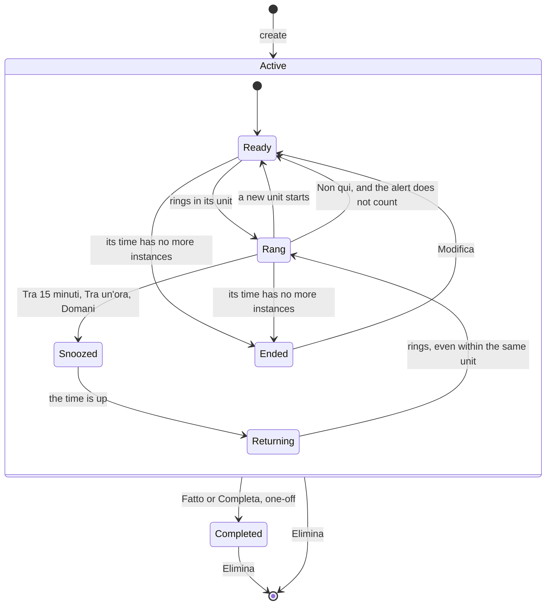

# ADR-0021: Ring a reminder once per occasion or per instance of its time, and keep perennial reminders

- **Status:** Accepted
- **Date:** 2026-10-03
- **Deciders:** devfrx
- **Sources:** the [0.2 decision map](https://github.com/devfrx/jiffin/issues/75): tickets [#76](https://github.com/devfrx/jiffin/issues/76) (occasion and return pause), [#78](https://github.com/devfrx/jiffin/issues/78) (perennial reminders), [#83](https://github.com/devfrx/jiffin/issues/83) (the alert and Rimanda), [#84](https://github.com/devfrx/jiffin/issues/84) (tray list and settings), [#81](https://github.com/devfrx/jiffin/issues/81), [#82](https://github.com/devfrx/jiffin/issues/82), [#89](https://github.com/devfrx/jiffin/issues/89), [#91](https://github.com/devfrx/jiffin/issues/91) and [#92](https://github.com/devfrx/jiffin/issues/92) (time), [#86](https://github.com/devfrx/jiffin/issues/86) (alerts measured), [#88](https://github.com/devfrx/jiffin/issues/88) (core design); amends [ADR-0014](0014-feedback-data-retention.md)

## Context

In 0.1 a reminder that is not completed rings at most once an hour
([#12](https://github.com/devfrx/jiffin/issues/12),
`docs/design/lifecycles.md`). After a day with the installed app the owner
asked for Rimanda "alla prossima volta", for alerts that come back when the
user returns to the thing after Utile or after vanishing unanswered, for
perennial reminders, never completed ("ogni volta che faccio questa cosa…"),
and for times in conditions ([ADR-0020](0020-read-the-time-in-core.md)).

Decided on the map:

- **One alert per occasion** ([#76](https://github.com/devfrx/jiffin/issues/76)).
  An occasion is one time the user is doing the thing of the condition; a new
  one starts when the user comes back to it after being away for at least the
  **return pause**, chosen in the settings: 2 minutes by default, 10 s at
  least, counted from when the user leaves the thing.
- **Perennial reminders**: a box, "Ogni volta", in the creation window
  ([#78](https://github.com/devfrx/jiffin/issues/78),
  [#84](https://github.com/devfrx/jiffin/issues/84)). In their alert Fatto
  means "done this time" ([#83](https://github.com/devfrx/jiffin/issues/83)).
- **The alert has three commands**, Fatto, Rimanda and the X; Rimanda opens a
  menu: Alla prossima volta, Tra 15 minuti, Tra un'ora, Domani, then Non qui;
  Utile is gone ([#83](https://github.com/devfrx/jiffin/issues/83)).
- **Times**: a moment rings once, a perennial one once a day
  ([#81](https://github.com/devfrx/jiffin/issues/81)); a slot without an app
  rings once per slot ([#89](https://github.com/devfrx/jiffin/issues/89)); a
  one-off time that came while the user was away rings when the user is back,
  even the next day, a perennial one only before 04:00
  ([#82](https://github.com/devfrx/jiffin/issues/82)); an ended period goes
  silent ([#91](https://github.com/devfrx/jiffin/issues/91)); a frequency
  rings once per period ([#92](https://github.com/devfrx/jiffin/issues/92)).

On the captured day of 2026-09-28, with the default pause, the occasion gives
103 alerts against 38 with "once an hour"
([#86](https://github.com/devfrx/jiffin/issues/86));
[ADR-0022](0022-acceptance-thresholds-v0-2.md) sets the thresholds for it.

## Decision

**A reminder rings at most once per unit.** The unit is:

- **the occasion**, for a reminder with a remainder (an app, a site, a thing
  the judge checks) whose time is a slot, a day or a period, or that has no
  time;
- **the instance of its time**, for a reminder with only a time, for moments
  and frequencies also with an app, and for a reminder that rings late, after
  its date.

**The occasion**, as measured in [#86](https://github.com/devfrx/jiffin/issues/86).
For a reminder with a remainder, a **true stretch** is a context stable for
5 s ([ADR-0019](0019-five-second-debounce.md)), judged at or above the
threshold, not silenced by "Non qui", while its time holds. Everything else
counts as away: other contexts, a quick switch, no context, a locked PC, a
window in full screen, a pause ([ADR-0024](0024-hold-and-hide-alerts.md)). An
occasion starts with a true stretch that begins at least the return pause
after the end of the previous one. A true stretch can also start or end while
the context stays in front, when a slot opens or closes: "quando apro Claude
dopo le 23", with Claude already in front, rings at 23:00.

**The instance** of a time: at most one per Jiffin day (that day's slot, the
whole day, the moment), or the period of a frequency. An instance may ring
from its start until:

| Time | One-off | Perennial |
|---|---|---|
| a moment ("alle 15") | the next moment: never lost ([#82](https://github.com/devfrx/jiffin/issues/82)) | 04:00 of that day ([#82](https://github.com/devfrx/jiffin/issues/82)) |
| a slot or a whole day that come back | the end of the slot or of the day ([#89](https://github.com/devfrx/jiffin/issues/89); for the day, deduced) | the same |
| with a date ("oggi alle 15", "stasera", "domani") | forever, until it has rung once ([#82](https://github.com/devfrx/jiffin/issues/82), [#89](https://github.com/devfrx/jiffin/issues/89); for "domani", deduced) | the end of the instance |
| a frequency | its period, within the hours and days it names, if any. Away for the whole period, it rings at the first occasion of the next one: the periods follow each other, so "as soon as you are back" (one-off) and "the next period" (perennial) of [#92](https://github.com/devfrx/jiffin/issues/92) are the same occasion | the same |
| within a period of dates | never after the period's end ([#91](https://github.com/devfrx/jiffin/issues/91)) | the same |

**When it rings.** An active reminder rings in a stable context when:

1. with a remainder, the context is judged true; with only a time, the user is
   there: any stable context will do (a locked or sleeping PC, a private
   window or a window of Jiffin in front, waits; so do a window in full screen
   and a pause, [ADR-0024](0024-hold-and-hide-alerts.md));
2. one of its instances may ring now (the table above);
3. it is not silenced in that context and not snoozed;
4. it has not rung yet in its unit.

When a snooze with a time ends, the first time 1–3 hold it rings even within
the same unit, as "Returning" does in 0.1: Tra 15 minuti and Tra un'ora are for
a user who stays on the same thing but is busy
([#83](https://github.com/devfrx/jiffin/issues/83)).

**Deadlines.** While a context is stable, `core` has one more deadline: the
next start or end of an instance of an active reminder. The worker treats it
like the debounce and the snoozes. At each deadline, the reminders with a
remainder evaluate the stable context again, from the cache, as at the end of
a snooze in 0.1; those with only a time ring, if the user is there.

**Outcomes of a judged reminder**, in this order: `below_threshold`,
`outside_time` (new: true, but out of its time), `silenced`, `snoozed`,
`same_occasion` (new: it already rang in its unit; it takes the place of
`held_back`, which stays in 0.1 rows), `alert`. All are judged, also out of
their time, as in 0.1: when the slot opens, the score is already in the cache.
A reminder with only a time is not judged: its alert has no evaluation and no
d.

**Answers** ([#83](https://github.com/devfrx/jiffin/issues/83)):

| Answer | Recorded | Then |
|---|---|---|
| Fatto, one-off | `fatto` | completed |
| Fatto, perennial | `fatto` | waits for the next unit |
| Alla prossima volta | `rimanda`, kind "next time" | waits for the next unit |
| Tra 15 minuti, Tra un'ora, Domani | `rimanda`, with its kind | nothing before then; then it rings at the first chance, even within the same unit |
| Non qui | `non_qui` | silent in that context until the text changes, **and the alert does not count**: it may ring elsewhere in the same unit |
| the X | `chiuso`, new: the "closed" of ADR-0014, without a label | waits for the next unit; not among "Non visti", since the user saw it |
| 10 s without an answer | nothing | waits for the next unit; goes among "Non visti" |

Utile is gone; `utile` stays in old rows.

**"Non visti" keeps one card per reminder**, the newest: the owner's choice on
[#88](https://github.com/devfrx/jiffin/issues/88). When a reminder rings
again, its old card leaves the list unanswered, and does not come back after a
restart: only unanswered alerts that are the last of their reminder are
loaded. With the 2-minute pause a reminder rang up to 22 times on the day of
#86: that would have been 22 cards.

**"Alla prossima volta"** shows only when the reminder has a next unit: with
the occasion as unit, when its time still holds after now, or it has none;
with the instance, when there is an instance after the current one. So not for
"domani alle 15" or "stasera". `core` computes it (`next_occasion`), and the
interface asks when it opens the menu.

**An ended period** ([#91](https://github.com/devfrx/jiffin/issues/91)) is not
a stored state: `core` computes it from the time and the clock (`ended`), and
the list writes "Periodo finito il …". A reminder whose date is past and that
cannot ring again (a perennial one, or a one-off that already rang) stays
silent and shows its date, without a new text (deduced).

**The return pause** is a setting, `return_pause`, in seconds: 120 by default,
from 10 to 7200 ([#76](https://github.com/devfrx/jiffin/issues/76),
[#84](https://github.com/devfrx/jiffin/issues/84)). The worker reads it at
start and passes it to `core`; a change applies at once.

**Being there: lock and sleep.** `core` knows the user is away only from the
capture's observations. A locked screen is not a context in 0.1, but it is not
verified that the capture says so at once: it says so at Windows' first event
after the lock. Nobody says when the PC goes to sleep: without a lock, the
context before would stay "in front" all night, and the occasion would not
start again on return. The capture must send "no context" when the screen
locks and before sleep, at the right time, and the context again on return;
where it does not, Windows' session and power notifications add it. To be
verified on the owner's machine while building.

**The capture starts with the worker**, not after the engine: a reminder with
only a time must ring while the model downloads or the engine is down. Until
the engine is ready, a context to judge gives a failed evaluation, as in 0.1
when the engine falls.

**After a restart of the app** each reminder starts again from when it last
rang (from the saved alerts, without those answered "Non qui") and from its
snoozes: the instances of a time stay exact. Occasions start afresh instead: a
user who restarts Jiffin while staying on the thing may get one alert more. It
is rare (Esci, then open again), and it is the mistake that shows
([ADR-0003](0003-acceptance-thresholds.md)).

**Deduced by Claude, beyond the above:**

- "Non qui" on a wrong context does not end the occasion: a silenced context
  is not a true stretch. Otherwise, after "Non qui" in Teams, a right reminder
  in Outlook would wait for the next occasion: a lost alert, which nobody
  sees. For a reminder with only a time it means "not here, remind me
  elsewhere": it rings in the next stable context, if its instance still
  holds.
- A moment with an app ("quando apro Claude alle 23") rings once, at the first
  occasion from the moment on, as a moment without an app.
- A date with an app, passed without ringing ("domani quando apro Teams", and
  Teams was not opened), rings once, late, at the first occasion after: never
  lost, as [#82](https://github.com/devfrx/jiffin/issues/82) and
  [#89](https://github.com/devfrx/jiffin/issues/89) want.
- A reminder with only a time waits for a context stable for 5 s, as all do
  ([ADR-0019](0019-five-second-debounce.md)): at most 5 s late.

**The states of a reminder:**

**Data: migration 0002** ([ADR-0013](0013-sqlite-storage.md)):

| Table | What changes | Why |
|---|---|---|
| `revision` | `created_at` (from 0.1 known only for the first revision: the others stay empty); `perennial`, 0 or 1; `schedule`, JSON or empty; `remainder` (in 0.1, the condition) | times and perennial reminders ([ADR-0020](0020-read-the-time-in-core.md)); and the harness, which must replay the edit of a reminder with only a time, never judged |
| `evaluation` | `context_until`: when the context left (empty while it is in front); `return_pause`, in ms (empty in 0.1) | to replay the exact occasions, as the threshold is already recorded |
| `candidate` | the outcomes `outside_time` and `same_occasion` | the new outcomes |
| `alert` | `d` may be missing (only a time); `due_at`: since when the alert was due (in 0.1, when its context arrived); the answer `chiuso`; `snooze`: which Rimanda | the delay from the moment ([ADR-0022](0022-acceptance-thresholds-v0-2.md)); "Ieri alle 15:00" in the alert ([#84](https://github.com/devfrx/jiffin/issues/84)); replaying a snooze of a reminder that has no evaluation to deduce it from |
| `setting` | the key `return_pause` | [#76](https://github.com/devfrx/jiffin/issues/76) |

- `candidate` and `alert` are rebuilt, since SQLite cannot change a CHECK or
  drop a NOT NULL. No table refers to them: foreign keys stay on inside the
  migration's transaction.
- `core` sends a new record, `Left` (the context, from when, until when), and
  `store` writes `context_until` on the evaluations of that stretch. When the
  app closes, the open stretch closes.
- `Store.load`: the last alert of each reminder does not count those answered
  "Non qui"; "Non visti" are the unanswered alerts that are the last of their
  reminder, no longer filtered on the evaluation (the cleanup at start already
  removes the expired ones). `Store.log` also keeps the alerts of reminders
  with only a time, which have no evaluation.

**What [ADR-0014](0014-feedback-data-retention.md) becomes.** The outcomes of
a judged reminder are those above. The answers are Fatto, Alla prossima volta
and the three timed Rimanda (each recorded with its kind), Non qui, the X
(`chiuso`), or vanished after 10 s. "Alla prossima volta" means "relevant", as
Utile and Rimanda did; the X gives no label, as "closed" did. Retention does
not change.

**Unchanged:** the engine, its protocol and the cache of judgements; revisions
with only a time have no cache entries.

**The harness** ([ADR-0017](0017-evaluation-harness-subpackage.md)):

- `replay` uses `context_until` and the recorded pause, and replays the
  alerts of reminders with only a time and the four snoozes from their
  recorded kind;
- `report` gives the delay from `due_at` for every alert, the reasons "out of
  time" and "same occasion", and counts the alerts of reminders with only a
  time apart: they are right when the time is read right
  ([ADR-0022](0022-acceptance-thresholds-v0-2.md));
- `label`: a label says whether the **remainder** is true in the context; the
  code checks the time;
- `statements`: for each reminder, the condition, the time understood, the
  remainder and the statement.

## Consequences

**Positive**

- One rule, measured in [#86](https://github.com/devfrx/jiffin/issues/86),
  holds every decision of the map: only what counts as a unit changes.
- Little extra state: when each reminder last rang, and its true stretches in
  the context in front.
- A reminder with only a time rings even while the model downloads or the
  engine is down.

**Negative (accepted)**

- More alerts than in 0.1: measured in #86, with the thresholds of
  [ADR-0022](0022-acceptance-thresholds-v0-2.md).
- After a restart an occasion starts afresh, and may give one alert more.
- Lock and sleep must reach `core` at the right time: not verified yet.

**Follow-up**

- Verify on the owner's machine that the capture reports lock, sleep and
  return at the right time; add Windows' session and power notifications where
  it does not.
- Verified on the owner's laptop, which sleeps in Modern Standby
  ([#99](https://github.com/devfrx/jiffin/issues/99)): the capture of 0.1 sent
  the lock screen as a context and nothing before sleep. Windows' notices came
  at the right time, the lock at once and the sleep 0.1 s after the display
  went off, also when the lid closed, and the capture now takes both
  ([context capture](../design/context.md)).
- When this is built, `docs/design/` follows in the same changes:
  `lifecycles.md` (these states and answers), `pipeline.md` (outcomes and time
  deadlines), `data-model.md` (migration 0002), `architecture.md` (the capture
  starts with the worker), `context.md` (lock and sleep), `creation.md`,
  `overlay.md`, `tray.md`, `settings.md` and `harness.md`.
