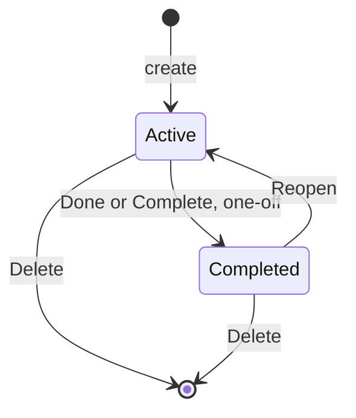

# ADR-0030: Hold an answer for 5 s with Undo, and keep completed reminders to reopen them

- **Status:** Accepted
- **Date:** 2026-10-07
- **Deciders:** devfrx
- **Sources:** the [0.3 decision map](https://github.com/devfrx/jiffin/issues/119): ticket [#129](https://github.com/devfrx/jiffin/issues/129) (decision, on live variants); amends [ADR-0021](0021-one-alert-per-unit.md)

## Context

The owner asked for a way back from a Done pressed by mistake
([#119](https://github.com/devfrx/jiffin/issues/119)). In 0.2 Done on the
alert and Complete in the tray list complete a one-off reminder at once, and
from Completed there is no way back (`docs/design/lifecycles.md`): the user
must write the reminder again.

Options, tried live on the owner's screen after the acceptance day of 0.2:

- **An Undo for a few seconds**, as in Gmail or Outlook: it catches the
  mistake seen at once, not the one found later.
- **Completed reminders kept in the list**, as in Microsoft To Do, whose round
  button the tray list already copies: it catches the mistake found later,
  with a click more.
- **Both.**

## Decision

**Both, one for the mistake seen at once and one for the mistake found
later** (the owner's choices: all the recommended options, 5 s, the text
struck through, the name `reopen`).

**Undo on the alert.**

- **The answers that change something wait 5 s:** Done, the four items of
  Snooze and Not here. In place of its buttons the alert shows the answer's
  name ("Fatto", "Tra 15 minuti", "Non qui"…) and "Annulla" (Undo); the bar of
  the 10 s becomes one of 5 s. After the 5 s the answer goes to `core`, and the
  alert leaves.
- **Undo** puts the alert back as it was, with its 10 s from the start.
- **The X leaves at once:** it gives no answer, so there is nothing to undo.
- **Everywhere there is an alert:** at the top, in the cards of "Non visti" in
  the tray list, and for the alert requested with Remind here
  ([ADR-0029](0029-learn-from-answers-per-place.md)).
- **The wait lives in the interface, not in `core`:** while it waits, the
  answer has not reached `core`, so there is nothing to undo there; unit and
  occasion stay those of an alert still on screen
  ([ADR-0021](0021-one-alert-per-unit.md)). If the app closes while an answer
  waits, the answer leaves at once and is not lost. If the reminder is
  completed or deleted from the tray list meanwhile, the alert leaves as in
  0.2, and the answer with it.
- **In a perennial reminder**, where Done means "done this time", the same
  Undo. A perennial reminder never completes, so it never goes among the
  completed.

**Completed reminders in the tray list.**

- **Complete in the tray list acts at once**, without a wait: the reminder
  goes among the completed, its way back. So does a one-off reminder closed
  with Done on its alert, once its 5 s are over.
- **The section comes after the active reminders**, closed at first: a row
  "Completati · 3" with the arrow; open, the reminders from the most recent.
- **Each row:** the full circle in the accent colour (`EC61`,
  CompletedSolid); the action struck through and grey (the owner's choice);
  under it, the condition without its time and when it was completed
  ("completato alle 11:52", "completato ieri"); the bin, which asks first, as
  among the active ones.
- **The full circle reopens it** (`reopen`, a name confirmed by the owner).
- **They stay until deleted**, as in 0.2
  ([ADR-0014](0014-feedback-data-retention.md)): completing hides, deleting
  erases.

**In `core`.** `reopen` clears `completed_at`, and the reminder is active
again under [ADR-0021](0021-one-alert-per-unit.md)'s rules: if it already rang
in its unit, it waits for the next one; a one-off reminder whose date is past
and that already rang stays silent and shows its date until it is edited. Its
alerts and answers stay. No migration: `completed_at` exists, and the store
already loads completed reminders; the view of the reminders adds them.

**Snooze, Not here and Delete.** Snooze and Not here have the same Undo on the
alert. After the 5 s, a Not here is withdrawn from the tray list or with the
opposite answer ([ADR-0029](0029-learn-from-answers-per-place.md)); a Snooze
waits for its time, and the tray list says when it comes back. Delete has no
Undo: it already asks first, and erases for real
([ADR-0014](0014-feedback-data-retention.md)).

**The states of a reminder** gain one arrow
([ADR-0021](0021-one-alert-per-unit.md)):

**What this amends.** [ADR-0021](0021-one-alert-per-unit.md): the way back
from Completed; an answer reaches `core` 5 s after the click, or at once when
the app closes.

## Consequences

**Positive**

- A mistake seen at once costs one click, and one found later costs two.
- `core` gets one command more and no state more; no migration.

**Negative (accepted)**

- Every answer that changes something reaches `core` 5 s later; an alert
  answered stays on screen those 5 s.
- Completed reminders stay in the tray list until deleted: a long section,
  closed at first.

**Follow-up**

- When this is built, `docs/design/` follows: `lifecycles.md` (the arrow
  Completed → Active), `overlay.md` (Undo) and `tray.md` (the section of the
  completed), with the mockups `overlay.html` and `tray.html`.
- Built in [#152](https://github.com/devfrx/jiffin/issues/152), with these
  deduced by Claude: the 5 s run on with the mouse over the alert, since it is
  there right after the click; the tray list closing sends a waiting answer at
  once, as quitting does, since a hidden list shows no Undo; a completed
  reminder keeps its true stretches, so a reopened one knows whether it rang
  in the occasion under way, and a snooze it had holds until it ends. A known
  limit: the harness cannot replay a Reopen, since a reminder keeps only its
  last completion and the log no reopen
  ([harness](../design/harness.md#replay)). Recording it would take the
  migration this decision avoids, for a correction that is rare.
