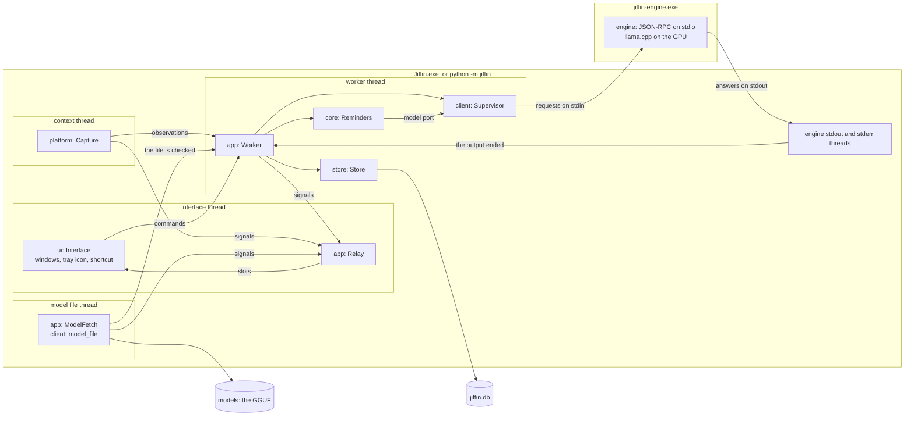

# Architecture

How the app is put together: two processes, the threads of the app, the parts
of the package and the ports between them
([ADR-0011](../adr/0011-engine-child-process-json-rpc.md),
[ADR-0012](../adr/0012-package-structure-ports.md)). The composition root is
`app/`: `root.py` makes the parts and starts them, `worker.py` is the worker
thread, `model.py` the model file's thread, and `relay.py` carries what the
threads say to the interface.

## Processes, threads and parts

| Thread | Owns | Gets its work from |
|---|---|---|
| interface | Qt, the QML windows, the tray icon, the shortcut, the relay | Qt's events, and the relay's slots |
| worker | `core`, the one connection to the database, the supervisor and through it the engine process | its queue, and its deadlines |
| context | the message loop, the WinEvent hooks, the window of Windows' notices and the COM apartment of the capture ([context](context.md)) | Windows |
| model file | one call to `model_file.ensure` at a time ([first run](first-run.md)) | the start, Retry, and a network problem tried again |
| engine stdout, stderr | the engine's pipes ([engine](engine.md)) | the engine process |

- **One owner.** Only the worker thread touches `core`, the store and the
  supervisor: `core` has no locks, and the database has one connection.
- **Into the worker.** The other threads put commands on its queue and never
  wait: what the interface asks of `core`, through `QueuedCore`; the capture's
  observations; the model file checked; an engine whose output ended. After
  each command the worker handles whatever deadline has come, on `core`'s
  clock: the engine's restart or sleep, the debounce or a snooze
  ([pipeline](pipeline.md)), the daily cleanup. Then it tells the supervisor
  what `core` needs of the engine now ([engine](engine.md#supervision)), and
  saves what `core` changed. A command that fails is logged, and the worker
  goes on.
- **Out to the interface.** The worker, the context thread and the model
  file's thread emit the relay's signals. The relay lives on the interface
  thread, so Qt runs its slots there, and they call `Interface.show_alerts`,
  `show_reminders`, `show_unreadable`, `show_engine` and `show_model`.
- **The ports** are the supervisor, the capture and the system clock in the
  app; the tests give the same composition the client's fake engine, replayed
  contexts and a simulated clock (`tests/unit/app/test_jiffin.py`).

## Start and shutdown

- **The packaged app** (`app/updates.py`, [ADR-0015](../adr/0015-package-pyinstaller-velopack.md))
  hands its start to Velopack first: on install, update and uninstall,
  Velopack's hooks end the process there. Then, before anything opens, it
  looks for a newer release in the folder the build wrote it to; Velopack's
  updater applies it once the process has ended, and starts Jiffin again.
- **One Jiffin per session.** A second start exits at once: two would share
  the database, the GPU's memory and the shortcut.
- **A database that cannot be opened**, from a later version after a
  downgrade, after a failed migration or a damaged file
  ([ADR-0013](../adr/0013-sqlite-storage.md)): the app does not start, and
  Windows' own message box says so and names the log.
- **Language files that cannot be read** stop the start before anything
  else, as the parts that use them are imported ([the language](#the-language)):
  `jiffin.app.main` imports the composition root inside a guard, and Windows'
  own message box says so in English, the one message the files cannot hold.
- **The capture starts with the worker**, before the engine: a reminder with
  only a time rings while the model downloads or the engine is down. Until the
  engine is ready, a context to judge gives a failed evaluation, as when the
  engine falls ([ADR-0021](../adr/0021-one-alert-per-unit.md)). A capture
  that cannot start is logged, and the app goes on without contexts.
- **The engine back.** When the supervisor reports it ready, after the first
  start or a restart, `core` writes the statements it missed and judges the
  stable context again; the cache spares what was judged already
  ([ADR-0011](../adr/0011-engine-child-process-json-rpc.md)). A wake from the
  light sleep is not a return, since nothing failed while the engine slept;
  a wake after one the GPU's memory refused is
  ([ADR-0027](../adr/0027-light-sleep-of-the-engine.md)).
- **The model file's thread** is a daemon: a download cut short by Quit keeps
  its part, and the next start resumes it.
- **The log** is `logs\jiffin.log` in the data folder: ids and numbers only, a
  new file at 1 MiB, four old ones kept. Uncaught exceptions and Qt's own
  messages go there too, since the packaged app has no console.

## The language

The Italian the app shows lives in the files of `src/jiffin/lang/it/`, not in
the code ([ADR-0026](../adr/0026-italian-in-language-files.md)): `texts.toml`
holds the texts of the interface, one key per text, named after the code's
names, and `time.toml` the words of a time, which `core` reads in a condition
and `ui/words.py` writes back ([time.md](time.md#the-lexicon)); `harness.toml`
holds the texts of the harness's pages, which the harness alone reads
([harness.md](harness.md#the-pages)). `lang` is a part of its own, without Qt,
that imports nothing else from the package; every other part may import it,
`core` included.

- **Read once, at import.** Each language file has a module that reads it into
  frozen dataclasses: `jiffin.lang.texts` reads `texts.toml` into `TEXTS`,
  `jiffin.lang.time` reads `time.toml` into `TIME`, `jiffin.lang.harness`
  reads `harness.toml` into `HARNESS`, and a file that cannot be read, a key
  missing or one too many raise `CatalogError`, which stops the tests and the
  start. `jiffin.lang.texts` also writes numbers, sizes and lists
  as the language writes them: "2.600.224.416", "2,4 GB", "Chrome e Brave".
- **Python** reads a text by its key, `TEXTS.alert.done`, and fills its
  placeholders, `TEXTS.app.cannot_start.format(log=…)`.
- **QML** reads every text through `Texts.qml`, a typed facade over the
  `Catalog` singleton of `ui/catalog.py`: each of its properties takes its key,
  and each sentence with a number, a size, a list or another placeholder comes
  written from Python. The modules of the windows import `ui/catalog.py`,
  which registers the singleton, before they load their QML.
- **Sentences are whole** in the files, with named placeholders; a text with a
  form for each count has `one` and `other`, chosen by the Italian rule; and a
  sentence that changes with its case, such as "In pausa fino alle 15:30." and
  "In pausa fino a domani alle 15:30.", is two keys the code chooses between.
- **Kept there by two checks.** The pre-commit hook `italian`,
  `scripts/check_italian.py`, which `ci.yml` runs too, fails on an Italian word
  outside the language files: a word with an accented vowel, or a word of the
  files themselves but for a few that are English too. A word passes quoted, as
  an example of what the user writes, and in a code span; the tests' literals,
  the accepted ADRs, the CHANGELOG and the mockups are not read. The hook reads
  every tracked file each time, since a word new in a language file can make an
  old comment Italian. `tests/unit/lang/test_keys.py` reads the code against
  the files: every key that QML, the pages and the Python ask for exists, every
  key of the files is asked for, each text gets the placeholders it holds, and
  each plural has its forms.
