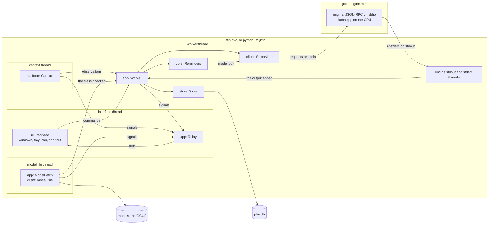
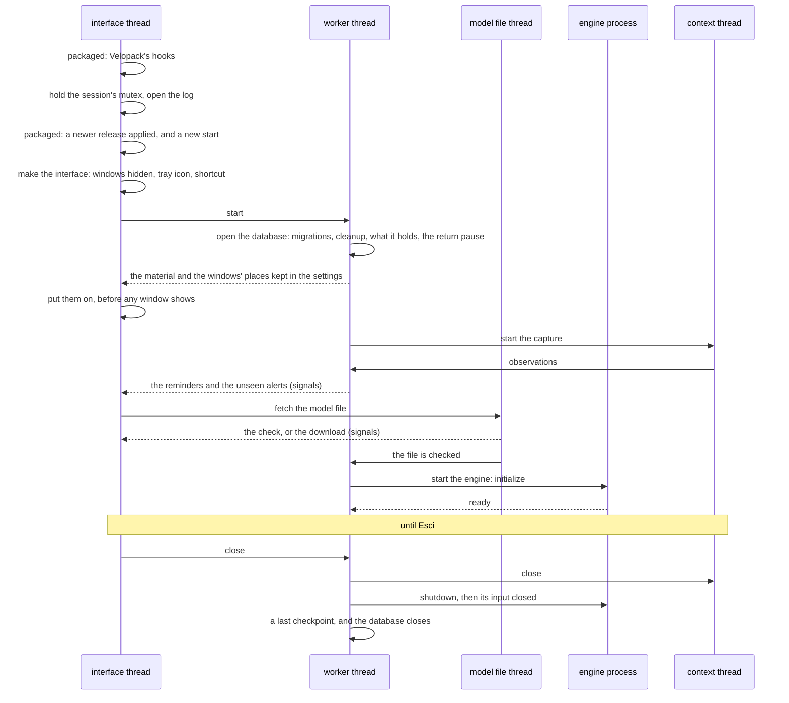

# Architecture

How the app is put together: two processes, the threads of the app, the parts
of the package and the ports between them
([ADR-0011](../adr/0011-engine-child-process-json-rpc.md),
[ADR-0012](../adr/0012-package-structure-ports.md)). The composition root is
`app/`: `root.py` makes the parts and starts them, `worker.py` is the worker
thread, `model.py` the model file's thread, and `relay.py` carries what the
threads say to the interface.

## Processes, threads and parts

| Thread | Owns | Gets its work from |
|---|---|---|
| interface | Qt, the QML windows, the tray icon, the shortcut, the relay | Qt's events, and the relay's slots |
| worker | `core`, the one connection to the database, the supervisor and through it the engine process | its queue, and its deadlines |
| context | the message loop, the WinEvent hooks, the window of Windows' notices and the COM apartment of the capture ([context](context.md)) | Windows |
| model file | one call to `model_file.ensure` at a time ([first run](first-run.md)) | the start, Riprova, and a network problem tried again |
| engine stdout, stderr | the engine's pipes ([engine](engine.md)) | the engine process |

- **One owner.** Only the worker thread touches `core`, the store and the
  supervisor: `core` has no locks, and the database has one connection.
- **Into the worker.** The other threads put commands on its queue and never
  wait: what the interface asks of `core`, through `QueuedCore`; the capture's
  observations; the model file checked; an engine whose output ended. After
  each command the worker handles whatever deadline has come, on `core`'s
  clock: the engine's restart, the debounce or a snooze
  ([pipeline](pipeline.md)), the daily cleanup. Then it saves what `core`
  changed. A command that fails is logged, and the worker goes on.
- **Out to the interface.** The worker, the context thread and the model
  file's thread emit the relay's signals. The relay lives on the interface
  thread, so Qt runs its slots there, and they call `Interface.show_alerts`,
  `show_reminders`, `show_unreadable`, `show_engine` and `show_model`.
- **The ports** are the supervisor, the capture and the system clock in the
  app; the tests give the same composition the client's fake engine, replayed
  contexts and a simulated clock (`tests/unit/app/test_jiffin.py`).

## Start and shutdown

- **The packaged app** (`app/updates.py`, [ADR-0015](../adr/0015-package-pyinstaller-velopack.md))
  hands its start to Velopack first: on install, update and uninstall,
  Velopack's hooks end the process there. Then, before anything opens, it
  looks for a newer release in the folder the build wrote it to; Velopack's
  updater applies it once the process has ended, and starts Jiffin again.
- **One Jiffin per session.** A second start exits at once: two would share
  the database, the GPU's memory and the shortcut.
- **A database that cannot be opened**, from a later version after a
  downgrade, after a failed migration or a damaged file
  ([ADR-0013](../adr/0013-sqlite-storage.md)): the app does not start, and
  Windows' own message box says so and names the log.
- **The capture starts with the worker**, before the engine: a reminder with
  only a time rings while the model downloads or the engine is down. Until the
  engine is ready, a context to judge gives a failed evaluation, as when the
  engine falls ([ADR-0021](../adr/0021-one-alert-per-unit.md)). A capture
  that cannot start is logged, and the app goes on without contexts.
- **The engine back.** When the supervisor reports it ready, after the first
  start or a restart, `core` writes the statements it missed and judges the
  stable context again; the cache spares what was judged already
  ([ADR-0011](../adr/0011-engine-child-process-json-rpc.md)).
- **The model file's thread** is a daemon: a download cut short by Esci keeps
  its part, and the next start resumes it.
- **The log** is `logs\jiffin.log` in the data folder: ids and numbers only, a
  new file at 1 MiB, four old ones kept. Uncaught exceptions and Qt's own
  messages go there too, since the packaged app has no console.
