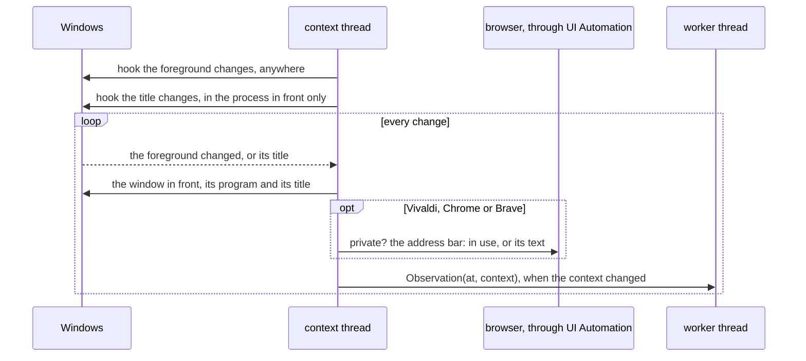

# Context capture

How the app sees what is in the foreground: the app, the window title and, in
the browsers, the address
([ADR-0004](../adr/0004-context-identity.md),
[ADR-0005](../adr/0005-browser-address-ui-automation.md)). The code is
`platform/`: `capture.py` is the context thread and its observations,
`address.py` reads the address bars through UI Automation, and `win32.py`
calls Windows.

## The context thread

- **The hooks** are out of context: Windows calls them on the thread that set
  them, from its message loop. The title hook moves with the process in front,
  since a hook on every process would bring the loop every name change of the
  whole system.
- **The apartment** is COM's multithreaded one, as UI Automation wants. The
  main thread stays in the single-threaded apartment Qt needs: comtypes puts
  the thread that imports it there.
- **Not contexts**: nothing in front (a locked screen), Jiffin's own windows, a
  program that cannot be opened, a private window, and a window that may be
  private.
- **A title** that ends halfway through an emoji is cleaned where it is read:
  the half left over becomes U+FFFD, which UTF-8 can carry to the engine.
- **The log** gets app names, counts and error codes; never a title or an
  address.

## A browser window

A private window has the same title as any other. UI Automation tells them
apart: Chrome and Brave end the name of their root view with "(In incognito)"
or "(Privato)", and Vivaldi has a `PrivateWindowIndicator` beside its address
bar. Vivaldi draws its interface as a web page, so its bar shows up only once
the client looks like assistive technology (a focus listener) and after a hit
test. The bar and the private flag of a window are kept for as long as it
exists.

| What UI Automation sees | Context | For the tray |
|---|---|---|
| the text of the bar (an empty bar: no address) | app, title, address | read |
| the bar has the focus: the user is typing | app and title | read |
| a private window | none | read |
| not private, but no bar, or an error reading it | app and title | failure |
| whether the window is private cannot be told | none | failure |

**A window that may be private is not a context.** ADR-0004 falls back to app
and title when the address cannot be read; when the private mark cannot be
read either, the window may be private, so it is ignored as a private one
would be. That is the case of the welcome page of a fresh Vivaldi, and of a
browser running as administrator, which UI Automation does not reach
(ADR-0005 expected app and title there).

## The unreadable signal

A browser update can break the reading. A browser's address is unreadable once
its bar has failed 5 times over at least 10 minutes, with no read in between:
long enough for a video in full screen, which hides the bar, and short enough
to notice a broken update within a working hour. One read clears it. Only tab
windows count, those whose title ends with the browser's suffix: a dialog, an
installed web app or DevTools has no bar. The tray gets the set of unreadable
browsers whenever it changes.

## Measured

Browsers turn on their accessibility tree when a UI Automation client appears,
and that CPU counts in the budget of
[ADR-0003](../adr/0003-acceptance-thresholds.md). The benchmark
(`uv run pytest -m benchmark -s`) keeps a fresh Vivaldi in front, on a page
whose title changes every second: 5 minutes without the capture, then 5 with
it, which reads the address at every change. On the owner's machine, 28
logical cores, on 2026-09-30:

| CPU | % of one core | % of the machine |
|---|---|---|
| Vivaldi, without the capture | 3.92 | 0.14 |
| Vivaldi, with the capture: 292 reads in 300 s | 4.63 | 0.17 |
| What the reads cost Vivaldi | 0.71 | 0.03 |
| The capture itself | 0.23 | 0.01 |

At one read a second, the reads cost Vivaldi under 1% of one core.
