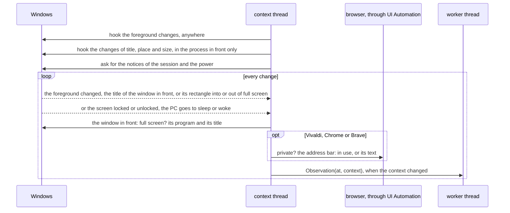

# Context capture

How the app sees what is in the foreground: the app, the window title and, in
the browsers, the address
([ADR-0004](../adr/0004-context-identity.md),
[ADR-0005](../adr/0005-browser-address-ui-automation.md)). The code is
`platform/`: `capture.py` is the context thread and its observations,
`address.py` reads the address bars through UI Automation, and `win32.py`
calls Windows.

## The context thread

- **The hooks** are out of context: Windows calls them on the thread that set
  them, from its message loop. The hook on the window in front moves with the
  process in front, since a hook on every process would bring the loop every
  change of the whole system. It takes two events that are next to each other:
  a title changed, and something moved or resized. A move matters only when
  the window in front goes into or out of full screen, so a drag reads
  nothing.
- **The notices** come to a message-only window on the same thread
  ([below](#away-lock-and-sleep)).
- **The apartment** is COM's multithreaded one, as UI Automation wants. The
  main thread stays in the single-threaded apartment Qt needs: comtypes puts
  the thread that imports it there.
- **Not contexts**: nothing in front, Jiffin's own windows, a program that
  cannot be opened, a private window, a window that may be private, and a
  window in full screen ([below](#full-screen)). Nothing is in front either
  while the screen is locked or the PC asleep.
- **A title** that ends halfway through an emoji is cleaned where it is read:
  the half left over becomes U+FFFD, which UTF-8 can carry to the engine.
- **The log** gets app names, counts and error codes; never a title or an
  address.

## A browser window

A private window has the same title as any other. UI Automation tells them
apart: Chrome and Brave end the name of their root view with "(In incognito)"
or "(Privato)", and Vivaldi has a `PrivateWindowIndicator` beside its address
bar. Vivaldi draws its interface as a web page, so its bar shows up only once
the client looks like assistive technology (a focus listener) and after a hit
test. The bar and the private flag of a window are kept for as long as it
exists.

| What UI Automation sees | Context | For the tray |
|---|---|---|
| the text of the bar (an empty bar: no address) | app, title, address | read |
| the bar has the focus: the user is typing | app and title | read |
| a private window | none | read |
| not private, but no bar, or an error reading it | app and title | failure |
| whether the window is private cannot be told | none | failure |

**A window that may be private is not a context.** ADR-0004 falls back to app
and title when the address cannot be read; when the private mark cannot be
read either, the window may be private, so it is ignored as a private one
would be. That is the case of the welcome page of a fresh Vivaldi, and of a
browser running as administrator, which UI Automation does not reach
(ADR-0005 expected app and title there).

## Away: lock and sleep

`core` knows the user is away only from the observations
([ADR-0021](../adr/0021-one-alert-per-unit.md)). The capture asks Windows for
two notices: the session's (`WTSRegisterSessionNotification`: locked,
unlocked) and the power's (`RegisterSuspendResumeNotification`: about to
sleep, awake). From a lock or a sleep it sends "no context"; it sends the
context in front again once the screen is unlocked and the PC awake, both. A
PC that does not lock when it sleeps is back as soon as it wakes: Windows says
so at every wake.

Measured on the owner's laptop on 2026-10-03
([#99](https://github.com/devfrx/jiffin/issues/99)). It sleeps in Modern
Standby, where `PBT_APMSUSPEND` is said not to come; it came, to a window
registered for it.

| What the owner did | Windows' notices | The capture of 0.1 |
|---|---|---|
| Win+L | locked, at once; unlocked, at the unlock | "no context" 2.1 s late, then the lock screen (`LockApp.exe`) and `explorer.exe` as contexts |
| Start, Sospendi | about to sleep 0.1 s after the display went off, and locked | nothing: the Start menu stayed in front for the 37 s of sleep |
| closing the lid | about to sleep and locked, within 0.1 s | nothing |
| waking it | awake at once; unlocked at the unlock | the lock screen as a context until then |

The display going off and the user's presence are notified too, at the same
moments, but not used: ADR-0021 speaks of lock and sleep. A screen that turns
off by itself, without a lock or sleep, leaves the context in front.

## Full screen

A window in full screen in front is not a context
([ADR-0024](../adr/0024-hold-and-hide-alerts.md)): nothing is judged and
nothing rings over a video, a slide show or a game, and leaving it is a
return. The capture compares the rectangle of the window in front with its
monitor's at every foreground change, and again when the window in front moves
or resizes: F11 changes the rectangle, not the window. The window is in full
screen when it covers its whole monitor and has no caption, no sizing frame
and no tool window's style, as Chromium tells it, and is not one of the
desktop's or the shell's windows, as LightBulb lists them.
`SHQueryUserNotificationState` is not used. A check takes about 6 µs.

| On the owner's screen | Rectangle | Styles | Full screen |
|---|---|---|---|
| a video, or F11, in Vivaldi | the monitor | no caption, no sizing frame | yes, at once, in and out |
| a game (Unity) | the monitor | a popup | yes |
| a maximized window (Claude, Steam) | over the monitor's edges, but not the taskbar | caption and sizing frame | no |
| the desktop (Win+D) | the monitor | a tool window | no |

A maximized window overhangs its monitor by its frame, also over a taskbar that
hides itself: its styles tell it apart. PowerPoint was not tried, since the
owner has none to use. A window in full screen on another monitor is not seen.
The coordinates are physical pixels on both sides: Qt makes the process aware
of each monitor's scale.

## The unreadable signal

A browser update can break the reading. A browser's address is unreadable once
its bar has failed 5 times over at least 10 minutes, with no read in between:
long enough to pass over a failure now and then, and short enough to notice a
broken update within a working hour. A window in full screen, which hides the
bar, is not read at all. One read clears it. Only tab
windows count, those whose title ends with the browser's suffix: a dialog, an
installed web app or DevTools has no bar. The tray gets the set of unreadable
browsers whenever it changes.

## Measured

Browsers turn on their accessibility tree when a UI Automation client appears,
and that CPU counts in the budget of
[ADR-0003](../adr/0003-acceptance-thresholds.md). The benchmark
(`uv run pytest -m benchmark -s`) keeps a fresh Vivaldi in front, on a page
whose title changes every second: 5 minutes without the capture, then 5 with
it, which reads the address at every change. On the owner's machine, 28
logical cores, on 2026-09-30:

| CPU | % of one core | % of the machine |
|---|---|---|
| Vivaldi, without the capture | 3.92 | 0.14 |
| Vivaldi, with the capture: 292 reads in 300 s | 4.63 | 0.17 |
| What the reads cost Vivaldi | 0.71 | 0.03 |
| The capture itself | 0.23 | 0.01 |

At one read a second, the reads cost Vivaldi under 1% of one core.
