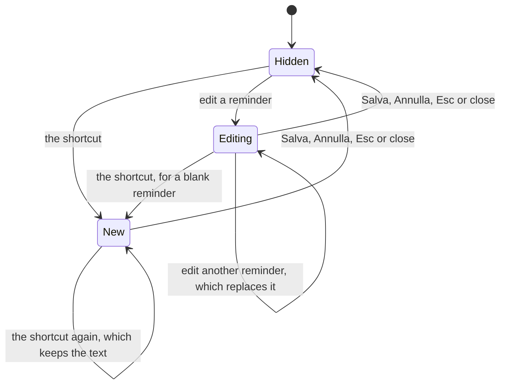

# Creating and editing a reminder

How a reminder is written, in `jiffin.ui`. `ui/hotkey.py` registers the
global shortcut, `ui/creation.py` holds the window's state, and
`qml/CreationWindow.qml` draws it with our own `FluentTextBox` and
`FluentButton`. The behaviour comes from decision ticket
[#12](https://github.com/devfrx/jiffin/issues/12), the shortcut from
[#43](https://github.com/devfrx/jiffin/issues/43), the look from
[ADR-0010](../adr/0010-windows-11-look-own-components.md); the
[mockup](mockups/creation.html) shows it in light and dark.

## The shortcut

- **Win+Shift+N**, chosen by the owner in #43: N for "Nuovo". Apps rarely use
  Win combinations, and `RegisterHotKey` found it free on the owner's machine.
- Qt has no global shortcuts. `RegisterHotKey` has Windows post `WM_HOTKEY`
  to the interface thread whatever app has the focus, and a native event
  filter picks it up; holding the keys down posts it once. The thread that
  gets it may bring its own window to the front.
- When another app holds the keys, the shortcut is not registered and the log
  says so.

## The window

- Two boxes, "Quando" and "Ricordami di", each showing an example in grey
  while empty, and under them the sentence they make: "Quando apro Figma, ti
  ricordo di esportare le icone." The user writes the whole condition,
  "quando …" or "se …"
  ([ADR-0008](../adr/0008-rewrite-conditions-english-statements.md)), and the
  judge gets exactly that box, with its spaces tidied (#12).
- Salva works once both boxes are written. Enter saves, or moves to the box
  still empty; a box never breaks a line. Tab moves from box to box and on to
  the buttons; Esc and Annulla drop what was written.
- Editing shows the reminder's texts, and Salva sends them to `core` as a new
  revision; `core` ignores a text that did not change.
- The window is a card like the alerts, chosen by the owner on screen (#43):
  the alerts' material and glass, no Windows title bar, "Nuovo promemoria" or
  "Modifica promemoria" as its first line. Like Windows' own panels it has no
  taskbar button; Win+Shift+N brings it back to the front. It is centred on
  the primary screen and takes the focus; once it hides, Windows gives the
  focus back to the app the user was in.

## Trying it

`uv run python -m jiffin.ui --creation` opens the window, and Win+Shift+N
opens it while that runs; Salva prints the reminder. The unit tests drive the
window on Qt's offscreen platform (`tests/unit/ui/test_creation.py`); the
shortcut pressed over another app, on the owner's machine, is in
`tests/integration/test_ui.py`.
