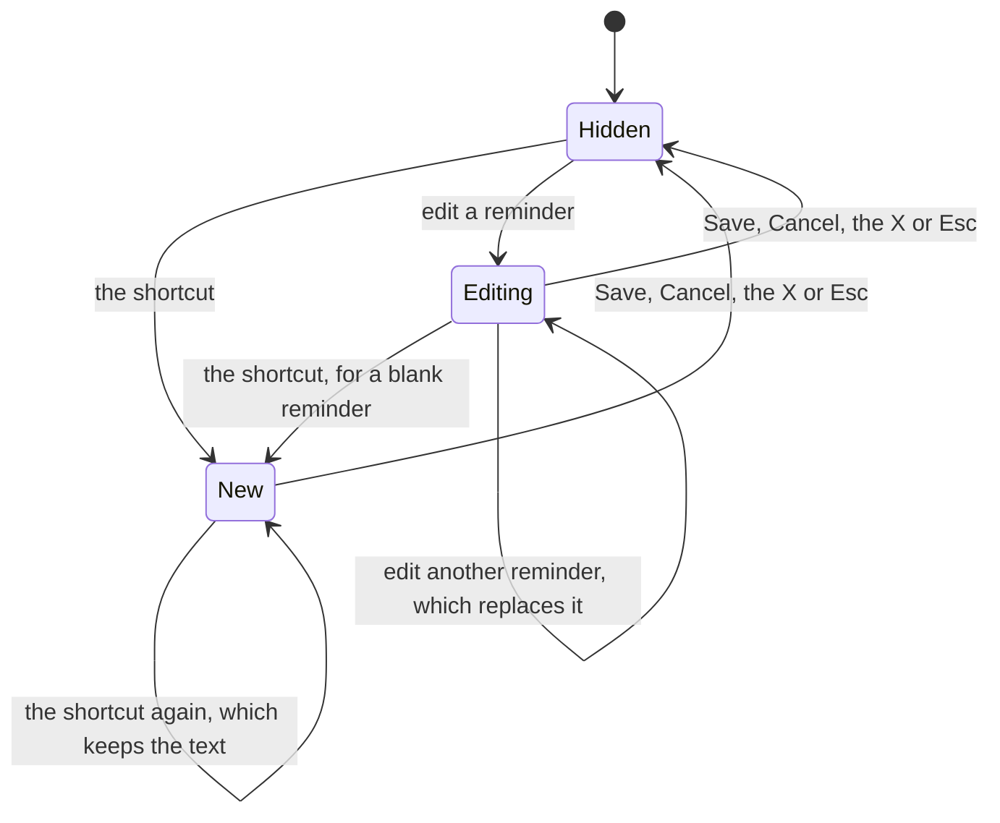

# Creating and editing a reminder

How a reminder is written, in `jiffin.ui`. `ui/hotkey.py` registers the
global shortcut, `ui/creation.py` holds the window's state, and
`qml/CreationWindow.qml` draws it with our own `FluentTextBox`,
`FluentCheckBox` and `FluentButton`. The behaviour comes from decision ticket
[#12](https://github.com/devfrx/jiffin/issues/12), the shortcut from
[#43](https://github.com/devfrx/jiffin/issues/43), the look from
[ADR-0010](../adr/0010-windows-11-look-own-components.md), the time and
"Ogni volta" from [ADR-0020](../adr/0020-read-the-time-in-core.md),
[ADR-0021](../adr/0021-one-alert-per-unit.md) and the variants chosen in
[#84](https://github.com/devfrx/jiffin/issues/84),
[#90](https://github.com/devfrx/jiffin/issues/90) and
[#92](https://github.com/devfrx/jiffin/issues/92); the
[mockup](mockups/creation.html) shows it in light and dark.

## The shortcut

- **Win+Shift+N**, chosen by the owner in #43: N for "Nuovo". Apps rarely use
  Win combinations, and `RegisterHotKey` found it free on the owner's machine.
- Qt has no global shortcuts. `RegisterHotKey` has Windows post `WM_HOTKEY`
  to the interface thread whatever app has the focus, and a native event
  filter picks it up; holding the keys down posts it once. The thread that
  gets it may bring its own window to the front.
- When another app holds the keys, the shortcut is not registered and the log
  says so.

## The window

- Two boxes, "Quando" and "Ricordami di", each showing an example in grey
  while empty, then the "Ogni volta" box, and under them the sentence they
  make: "Quando apro Figma, ti ricordo di esportare le icone." The user writes
  the whole condition, "quando …" or "se …", with its time if it has one
  ([ADR-0008](../adr/0008-rewrite-conditions-english-statements.md),
  [ADR-0020](../adr/0020-read-the-time-in-core.md)), and the judge gets
  exactly that box, with its spaces tidied (#12); `core` takes the time words
  out before rewriting it.
- Save works once both boxes are written and the time is not over. Enter
  saves, or moves to the box still empty, or to "Quando" while its time is
  over; a box never breaks a line. Tab moves from box to box, to "Ogni volta"
  and on to the buttons; Esc and Cancel drop what was written.
- Editing shows the reminder's texts and its "Ogni volta", and Save sends
  them to `core` as a new revision; `core` ignores a text that did not change.

## The time and "Ogni volta"

- **The time is read at every key** with `core`'s `read`
  ([time.md](time.md)), on the interface thread: it takes 0.1–0.2 ms. Under
  "Quando", in place of the hint ("Descrivi dove sei o quando: un'app, un
  sito, un orario."), a line beside a clock (`E121`) says what Jiffin
  understood, in the words of [the time's words](time.md#the-words-of-a-time):
  "Ogni giorno dalle 23:00 alle 04:00". Without a time the hint stays.
- **Words not understood** are named on that line, the clock in the warning
  colour: "Non capisco «verso sera»: suona a qualsiasi ora." (#90). Save
  stays on: the reminder saves without a time, its whole condition judged.
- **A time already over** (`past`: "oggi alle 9" written at 10) turns the
  clock to the warning colour and Save off, and the info bar's warning line
  under the sentence says why: "Oggi alle 09:00 è già passato. Per salvare,
  scrivi un giorno o un'ora che deve ancora venire." (#84). Save reads the
  time again when clicked: a time that passed while the window was open stops
  the saving there, instead of a reminder that would never ring.
- **"Ogni volta"** is WinUI's check box: 20 px, corners of 4 px, the
  CheckMark (`E73E`) at 12 px, the radio buttons' colours; under it, "Suona
  ogni volta che succede, e non si completa mai." Ticked, the sentence says
  "ti ricordo ogni volta di …", the reminder is perennial
  ([ADR-0021](../adr/0021-one-alert-per-unit.md)), and every day shows before
  the hours ("Ogni giorno dalle 23:00 alle 04:00" where a one-off reads "Dalle
  23:00 alle 04:00").
- **Words of a recurrence tick it by themselves** (`recurring`: "ogni…", "il
  primo lunedì del mese"), when they appear, while the user has not touched
  the box; they untick it when they go, if they had ticked it. Once the user
  ticks or unticks it, the words no longer move it (#92). The words already
  there when the window opens never move it: Edit shows it as it was.
- **Edit keeps the saved time** while the condition is unchanged, as
  `core` does: the line shows the saved time, written for today ("domani alle
  15" written yesterday reads "Oggi, …"), and it is never over, so an old
  reminder can still be edited. Once the condition changes it is read again
  from now. Known limit: a saved condition without a time that `read`
  understands today ("fino al 31" written in a month of 30 days) shows the
  hint, not "Non capisco".
- The window is a card like the alerts, chosen by the owner on screen (#43):
  the alerts' material and glass, no Windows title bar, "Nuovo promemoria" or
  "Modifica promemoria" as its first line. Like Windows' own panels it has no
  taskbar button; Win+Shift+N brings it back to the front, where it is. It
  takes the focus; once it hides, Windows gives the focus back to the app the
  user was in.
- **The frame** ([ADR-0023](../adr/0023-window-frame.md)): an X on the
  title's line, a Subtle button 12 px from the right edge, closes as Cancel
  does; Tab passes it by, since Esc does the same. The window drags from any
  point no control takes: a `DragHandler` hands the drag to Windows with
  `startSystemMove()`, and a drag that starts on a button or a box stays
  theirs.
- It opens at the centre of the primary screen's work area, or where the user
  left it, also after a restart; at the centre when that place is no longer
  whole on a screen, a monitor unplugged. `ui/places.py` follows the moves,
  and the app keeps the places with the [settings](settings.md). While it
  shows, it grows downwards as the sentence takes a second line, and never
  moves by itself.

## Trying it

`uv run python -m jiffin.ui --creation` opens the window, and Win+Shift+N
opens it while that runs; Save prints the reminder. The unit tests drive the
window on Qt's offscreen platform (`tests/unit/ui/test_creation.py`); the
shortcut pressed over another app, on the owner's machine, is in
`tests/integration/test_ui.py`.
