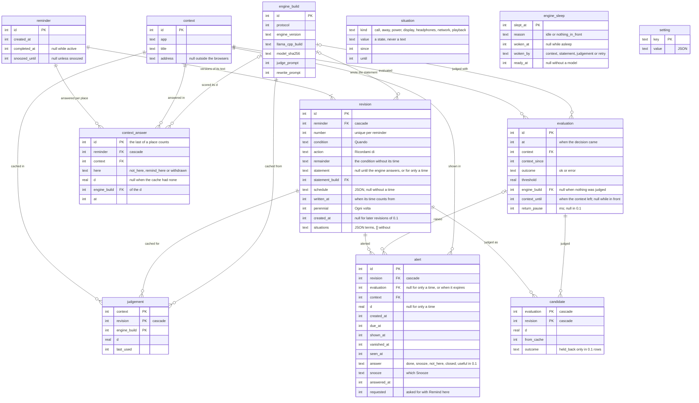

# Data model

The SQLite schema of `jiffin.store`
([ADR-0013](../adr/0013-sqlite-storage.md)): one file,
`%LOCALAPPDATA%\Jiffin\jiffin.db`, `STRICT` tables, times in UTC
milliseconds. The source of truth is `store/migrations/`; this diagram follows
the latest migration.

## Version 0.2

Migration 0002 ([ADR-0021](../adr/0021-one-alert-per-unit.md)) adds the
columns of times, "Ogni volta", the stretches in front and the return pause,
and rebuilds `candidate` and `alert` for their new outcomes, answers and the
alerts without a judgement; no table refers to them, so foreign keys stay on.
A revision of 0.1 has no time, and its remainder is its condition; an alert of
0.1 was due when its context came. `schedule` is `store/schedules.py`'s JSON,
the shape of the time cases. `written_at` is not in ADR-0021's table: it keeps
when a condition was written across a Edit that does not change it, as
[ADR-0020](../adr/0020-read-the-time-in-core.md) wants.

- **What loads**: the last alert of each reminder not answered Not here, the
  one that counts in its unit; the unseen alerts are the shown, unanswered
  alerts that are the last of their active reminder.
- **The harness's log** keeps the alerts of reminders with only a time, which
  have no evaluation, and when each evaluated context left.

## Version 0.3

Migration 0003 stores the answers in English
([ADR-0026](../adr/0026-italian-in-language-files.md)): the rebuild of
`alert` translates those of 0.1 and 0.2 with a `CASE`, and adds `requested`,
the alerts asked for with Remind here
([ADR-0029](../adr/0029-learn-from-answers-per-place.md)). `candidate` is
rebuilt for `outside_situation`, and `revision` gains its situations, the
terms as `store/terms.py`'s JSON, `[]` before 0.3
([ADR-0028](../adr/0028-read-the-situations-in-core.md)). Three tables are
new:

- **`context_answer`** takes the place of `silence`: a row for every answer
  per place and every withdrawal, a change of text included. Each silence
  became a Not here with the d, the build and the time of the last alert its
  reminder had answered Not here in that context; one whose alert was gone
  takes the time of its reminder.
- **`situation`**: a row per stretch of a value of a situation, once it
  ended. The values are states (an app's executable, a site, `yes`, `home`),
  never texts.
- **`engine_sleep`**: a row per light sleep of the engine
  ([ADR-0027](../adr/0027-light-sleep-of-the-engine.md)), written when it
  starts and replaced when it ends, so a sleep under way when the app dies
  keeps its start.

- **What loads**, besides 0.2's: the answer that counts in each place, the
  last one there unless it was withdrawn, the last answered last; and each
  revision's situations. The stretches load nothing: `core` reads the
  situations again from the capture.
- **The harness's log** keeps every answer per place, in order, and the
  requested alerts, which have no evaluation.

## Keeping and deleting

- **Cleanup**, at startup and daily, in one transaction
  ([ADR-0014](../adr/0014-feedback-data-retention.md)): evaluations older than
  30 days, with their candidates; unanswered alerts older than 30 days; cache
  entries unused for 30 days; stretches of situations that ended, and sleeps
  of the engine that began, more than 30 days ago; contexts no row uses any
  more. Then `PRAGMA optimize` and a `TRUNCATE` checkpoint.
- **The answers per place** stay until their reminder is deleted, the
  withdrawals too: the last of a place counts, the others serve the replay.
- **Deleting a reminder** cascades to its revisions, and through them to its
  candidates, alerts and cache entries, and to its answers per place. Then the
  evaluations it leaves without candidates and the unused contexts go, and a
  `TRUNCATE` checkpoint follows, so that nothing about it stays in the WAL.
- A context is one row whatever its address: `context_identity` indexes the
  address with a missing one counted as a single value.
- Engine builds are kept: they are not personal data.
