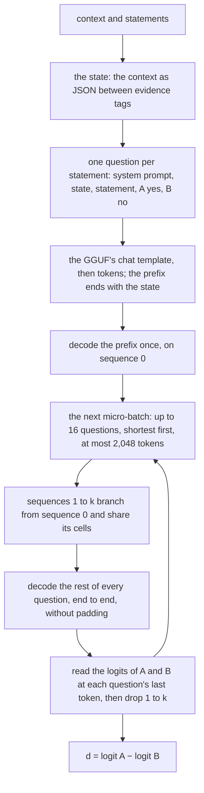

# Engine

How the app drives the engine process, how the engine judges a context, and
how it rewrites a condition ([ADR-0006](../adr/0006-judge-rizzo-flow-q4.md),
[ADR-0008](../adr/0008-rewrite-conditions-english-statements.md),
[ADR-0011](../adr/0011-engine-child-process-json-rpc.md)). The code is
`engine/`: `server.py` speaks the protocol, `prompts.py` writes the prompts,
`backend_llama.py` scores and generates, and `llama_cpp.py` binds llama.cpp.
The last three derive from Rizzo Flow at commit `b9ba007e`
([NOTICE](../../NOTICE)).

## The process

One request at a time, in order: judging and rewriting share one model and one
context. `initialize` again replaces the model; after `shutdown` the engine
has none, as before `initialize`.

What each failure answers, besides the protocol's own errors:

| Failure | Code |
|---|---|
| `judge` or `rewrite` before `initialize`, or after `shutdown` | −32001 not initialized |
| another protocol version | −32002 protocol mismatch |
| no model file, no llama.cpp runtime, no CUDA GPU, another architecture, no chat template | −32003 model cannot be loaded |
| llama.cpp logged "out of memory" while loading | −32004 GPU out of memory |
| a question longer than the context per question; a rewrite prompt that leaves no room for 64 tokens; a statement that does not end within 64 tokens | −32005 text too long |
| anything else | −32603 internal error, with the exception in the detail |

## One `judge`

- **The prompt** is the prototype's format `json / en / f2 / sa`, within Rizzo
  Flow's decision prompt v3: the engine writes, byte for byte, the prompt the
  prototype measured. The only difference is a `</` inside a title or an
  address, written `<\/` so it cannot close the evidence.
- **The context** holds 2,048 tokens per question plus 2,048 for one
  micro-batch, in one buffer shared by 17 sequences, with an f16 KV cache and
  full-size sliding-window layers: 3,227 MiB of VRAM once loaded.
- **The numbers depend on the batch layout.** In the prototype's layout (18
  questions per context, micro-batches of 4, 8,192 tokens) the engine gives
  exactly the prototype's d. With the settings of ADR-0011, d moves by 0.08 on
  average and 0.37 at most, and the AUROC stays the same (0.986).

## One `rewrite`

- **The prompt** is v2 of ADR-0008: its instructions as the system message,
  its eight examples as turns of the conversation, then the condition as the
  user wrote it; the GGUF's chat template, thinking disabled.
- **Greedy decoding:** the prompt on sequence 0, then one token at a time, each
  the most likely, until the model ends the generation. The statement is what
  it wrote, without the space around it. A statement that goes past 64 tokens
  is refused, never cut.
- The engine writes the prototype's statements for the nine conditions of the
  sample, word for word, in about 0.3 s each; with rewriting, the VRAM peak
  moves from 3,251 to 3,257 MiB.
