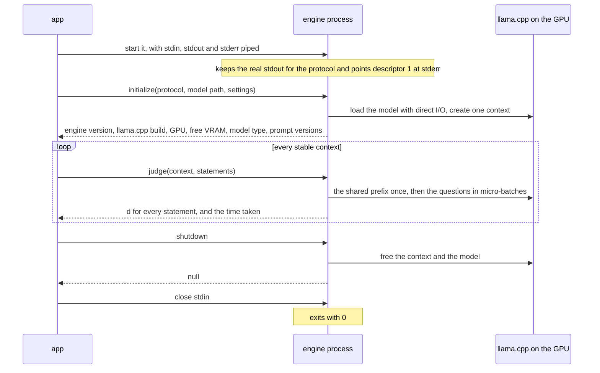
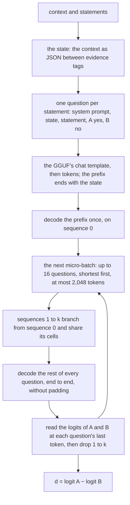

# Engine

How the app drives the engine process, and how the engine judges a context
([ADR-0006](../adr/0006-judge-rizzo-flow-q4.md),
[ADR-0011](../adr/0011-engine-child-process-json-rpc.md)). The code is
`engine/`: `server.py` speaks the protocol, `prompts.py` writes the questions,
`backend_llama.py` scores them and `llama_cpp.py` binds llama.cpp. The last
three derive from Rizzo Flow at commit `b9ba007e` ([NOTICE](../../NOTICE)).

## The process

One request at a time, in order. `initialize` again replaces the model;
after `shutdown` the engine has none, as before `initialize`. Until condition
rewriting arrives, `rewrite` answers "Method not found".

What each failure answers, besides the protocol's own errors:

| Failure | Code |
|---|---|
| `judge` before `initialize`, or after `shutdown` | −32001 not initialized |
| another protocol version | −32002 protocol mismatch |
| no model file, no llama.cpp runtime, no CUDA GPU, another architecture, no chat template | −32003 model cannot be loaded |
| llama.cpp logged "out of memory" while loading | −32004 GPU out of memory |
| a question longer than the context per question | −32005 text too long |
| anything else | −32603 internal error, with the exception in the detail |

## One `judge`

- **The prompt** is the prototype's format `json / en / f2 / sa`, within Rizzo
  Flow's decision prompt v3: the engine writes, byte for byte, the prompt the
  prototype measured. The only difference is a `</` inside a title or an
  address, written `<\/` so it cannot close the evidence.
- **The context** holds 2,048 tokens per question plus 2,048 for one
  micro-batch, in one buffer shared by 17 sequences, with an f16 KV cache and
  full-size sliding-window layers: 3,227 MiB of VRAM once loaded.
- **The numbers depend on the batch layout.** In the prototype's layout (18
  questions per context, micro-batches of 4, 8,192 tokens) the engine gives
  exactly the prototype's d. With the settings of ADR-0011, d moves by 0.08 on
  average and 0.37 at most, and the AUROC stays the same (0.986).
