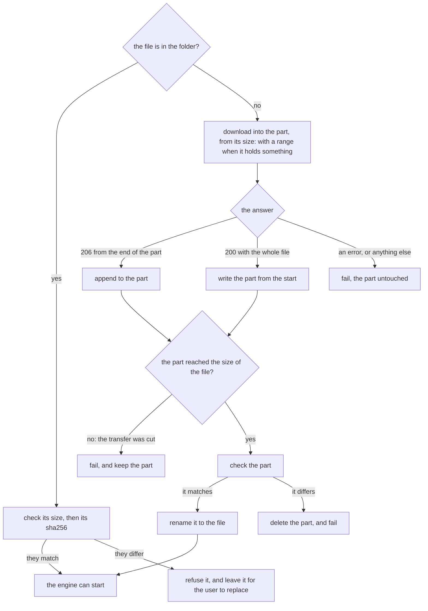
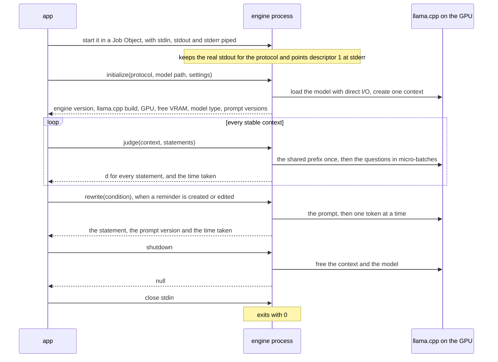
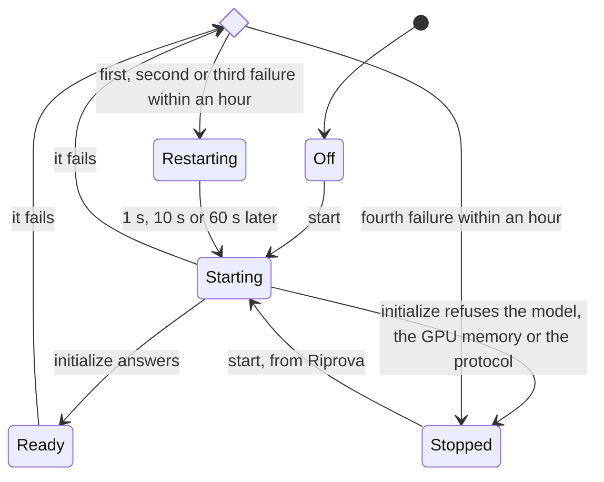
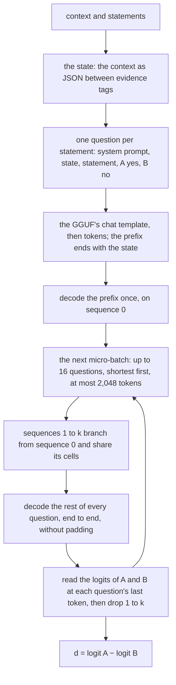

# Engine

How the app gets the model file and drives the engine process, how the engine
judges a context, and how it rewrites a condition
([ADR-0006](../adr/0006-judge-rizzo-flow-q4.md),
[ADR-0008](../adr/0008-rewrite-conditions-english-statements.md),
[ADR-0011](../adr/0011-engine-child-process-json-rpc.md),
[ADR-0015](../adr/0015-package-pyinstaller-velopack.md)). The code is
`engine/`: `server.py` speaks the protocol, `prompts.py` writes the prompts,
`backend_llama.py` scores and generates, and `llama_cpp.py` binds llama.cpp.
The last three derive from Rizzo Flow at commit `b9ba007e`
([NOTICE](../../NOTICE)). The app's side is `client/`: `model_file.py` gets the
model file and checks it, `supervisor.py` is the model port and the restarts,
`process.py` one engine process with its pipes, and `job.py` its Job Object.

## The model file

The installer does not ship the model: `model_file.ensure` gets it from the
revision ADR-0006 pins, into the `models` folder beside the database, and
checks it before every start of the engine. It blocks, for minutes when it
downloads and 3.7 s when it only checks, so the app calls it on a thread of its
own.

- **The part** is `<name>.part`. A network failure never loses what arrived:
  the next call resumes with a range. An answer that is not the file, such as
  the login page of a public Wi-Fi, is refused before a byte is written.
- **Every failure names one problem** for the interface: the network (the next
  call resumes), the space (the rest of the download and 1 GiB more must be
  free), the disk, or a mismatch. The messages name files and numbers, never a
  folder.
- **Offline**, the interface tells the user where to put the file, with its
  address, size and sha256. The file gets the same check, and a wrong one is
  refused, never deleted.
- **Progress** comes in bytes after every MiB, for the download and for the
  check.
- On 2026-09-30 the pinned address redirected to Hugging Face's CDN, which
  answered a range with 206 and the full size of the file.

## The process

One request at a time, in order: judging and rewriting share one model and one
context. `initialize` again replaces the model; after `shutdown` the engine
has none, as before `initialize`.

What each failure answers, besides the protocol's own errors:

| Failure | Code |
|---|---|
| `judge` or `rewrite` before `initialize`, or after `shutdown` | −32001 not initialized |
| another protocol version | −32002 protocol mismatch |
| no model file, no llama.cpp runtime, no CUDA GPU, another architecture, no chat template | −32003 model cannot be loaded |
| llama.cpp logged "out of memory" while loading | −32004 GPU out of memory |
| a question longer than the context per question; a rewrite prompt that leaves no room for 64 tokens; a statement that does not end within 64 tokens | −32005 text too long |
| anything else | −32603 internal error, with the exception in the detail |

## Supervision

What the app does when the engine fails. The worker thread owns the
supervisor, and the tray shows its state.

- **It fails** when its process exits, its output ends or cannot be read, a
  request gets no answer in time (`initialize` 120 s, `judge` 15 s, `rewrite`
  30 s), or it cannot be started at all. The supervisor kills it, the pending
  call fails, and its last 50 lines of stderr go to the app log.
- **An error answer is not a failure**: that call fails, and the engine goes
  on. At `initialize` the model, the GPU memory and the protocol version stop
  the engine, since starting it again cannot mend them; any other error counts
  as a failure.
- **While it is down**, calls fail at once, and `build` still gives the last
  engine's build, so cached scores keep working.
- **Time:** the restart waits on the app's clock. The worker calls `poll` at
  the supervisor's deadline, and when the stdout thread reports that the
  output ended while the engine was idle.
- **The Job Object** kills the engine when the app closes it, or when the app
  dies. A process joins a job only if its parent was in the job when it was
  created, and in a checkout uv's `python.exe` is a launcher that starts the
  real interpreter as its child: so the engine is created suspended, put in
  its job, and only then resumed.
- **Closing**, from any state, leads back to Off: it sends `shutdown`, then
  closes stdin, and an engine that does not answer, or does not exit, within
  10 s is killed.
- **Stderr** is UTF-8, whatever the code page. It holds no titles, addresses or
  reminder texts: the engine's messages name files, sizes and ids.

## One `judge`

- **The prompt** is the prototype's format `json / en / f2 / sa`, within Rizzo
  Flow's decision prompt v3: the engine writes, byte for byte, the prompt the
  prototype measured. The only difference is a `</` inside a title or an
  address, written `<\/` so it cannot close the evidence.
- **The context** holds 2,048 tokens per question plus 2,048 for one
  micro-batch, in one buffer shared by 17 sequences, with an f16 KV cache and
  full-size sliding-window layers: 3,227 MiB of VRAM once loaded.
- **The numbers depend on the batch layout.** In the prototype's layout (18
  questions per context, micro-batches of 4, 8,192 tokens) the engine gives
  exactly the prototype's d. With the settings of ADR-0011, d moves by 0.08 on
  average and 0.37 at most, and the AUROC stays the same (0.986).

## One `rewrite`

- **The prompt** is v2 of ADR-0008: its instructions as the system message,
  its eight examples as turns of the conversation, then the condition as the
  user wrote it; the GGUF's chat template, thinking disabled.
- **Greedy decoding:** the prompt on sequence 0, then one token at a time, each
  the most likely, until the model ends the generation. The statement is what
  it wrote, without the space around it. A statement that goes past 64 tokens
  is refused, never cut.
- The engine writes the prototype's statements for the nine conditions of the
  sample, word for word, in about 0.3 s each; with rewriting, the VRAM peak
  moves from 3,251 to 3,257 MiB.
