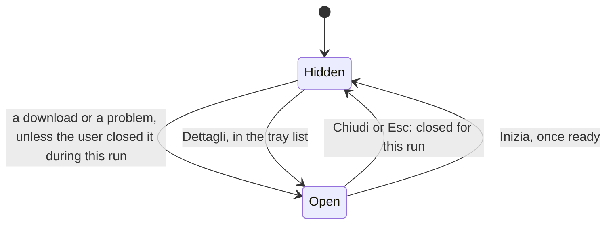

# The first run

What the user sees while the model file is on its way, in `jiffin.ui`. The
installer does not ship the model
([ADR-0015](../adr/0015-package-pyinstaller-velopack.md)): at the first start
the app downloads it, 2.4 GB in minutes, and checks it; only then can the
engine start ([engine](engine.md)). `ui/first_run.py` holds the state, and
`qml/FirstRunWindow.qml` draws it with our own `FluentProgressBar`,
`FluentInfoBar` and `FluentButton`; the tray list shows a line of it. The
behaviour and the look come from
[#43](https://github.com/devfrx/jiffin/issues/43); the
[mockup](mockups/first-run.html) shows it in light and dark.

## What the app says

At every start, before the engine starts, the app maps
`client.model_file`'s progress and problems to a `ModelState` and gives it
to `Interface.show_model` ([#44](https://github.com/devfrx/jiffin/issues/44)):

| Stage | From `model_file` |
|---|---|
| `CHECKING` | `Progress` in the `CHECKING` phase: at every start, 3.7 s, and after a download |
| `DOWNLOADING` | `Progress` in the `DOWNLOADING` phase |
| `READY` | `ensure` returned: the engine can start |
| `NETWORK`, `SPACE`, `DISK`, `MISMATCH` | the `Problem` of a `ModelFileError`; `SPACE` carries its `missing` bytes |

`Interface` also takes a `ModelFile`: the pin's name, address, size and
sha256, and the models folder, which the window shows for the file by hand,
since the interface does not import `client`
([ADR-0012](../adr/0012-package-structure-ports.md)). Riprova calls the
app's `fetch_model`, which runs `ensure` again; it resumes a download from
what arrived.

## The window

- The plain check at every start opens nothing: the window opens by itself
  only when the model needs the user to wait or to act. Once the user closes
  it, it stays closed for this run, and the tray list carries on.
- **Three steps**, chosen by the owner on screen over a plain card and one
  with the app's glyph: Scarico il modello, Controllo il file, Pronto. Each
  has a disc with its number, the accent's ring while it runs, the caution
  colour's when it stopped, and a check once done. The running step has a
  bar, and the download a line under it: "0,8 GB di 2,4 GB · circa 4 min".
  The time left comes from the last 30 s of the download, and shows after
  5 s of it.
- Sizes are in gigabytes of 1,024³ bytes, as Windows' Explorer shows them.
- Under the steps, while it waits: the reminders can already be written, with
  Win+Shift+N, or from Nuovo in the tray list when another app holds the
  shortcut.
- **A problem** keeps the step it stopped at, with its bar paused, and shows
  as a line with Riprova, which reads "Riprovo…" until the app answers:

  | Problem | The window says |
  |---|---|
  | `NETWORK` | the download stopped: check the connection; Riprova resumes it |
  | `SPACE` | the disk is full: free so many GB, in tenths rounded up |
  | `DISK` | the models folder cannot be written or read |
  | `MISMATCH` | the file is not the right one: replace it or delete it, then Riprova |

- **By hand**, offline or with the wrong file: "Senza rete? Mettilo a mano"
  opens three steps: the address to download the file from, which a button
  copies; the models folder and the file's name, which a button opens in
  Explorer, made first; and the size in bytes and the sha256 that Riprova
  checks.
- **Ready**: "Jiffin è pronto", how to write a reminder, and where the tray
  icon is: Windows 11 puts a new icon in the ^ overflow, so the window says to
  drag it onto the taskbar. Inizia closes it.
- It is a card like the creation window, centred and with the focus, without
  Windows' title bar or a taskbar button; it stays centred as steps and lines
  come and go.

## In the tray list

While the model downloads or has a problem, the tray list shows it on top, as
a quiet line: the download in the accent's colour, with its bar and "Finché
non è pronto, i promemoria non avvisano."; a problem in the critical colour,
with Riprova. Both have Dettagli, which opens the window again
([tray](tray.md)).

## Trying it

`uv run python -m jiffin.ui --model download` plays a download of a minute,
its check and ready; `--model network`, `space`, `disk` or `mismatch` starts
with that problem, which Riprova mends. The unit tests drive the window and
the tray list's line on Qt's offscreen platform
(`tests/unit/ui/test_first_run.py`, `test_tray_list.py`).
