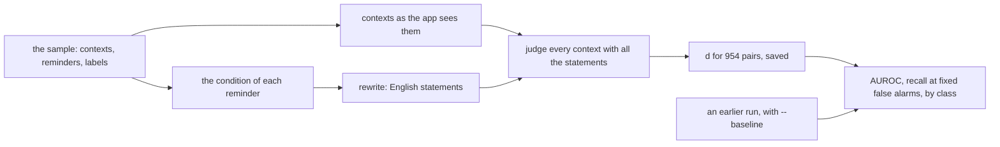

# Evaluation harness

How the app is measured against the thresholds of
[ADR-0003](../adr/0003-acceptance-thresholds.md), on the acceptance day and
whenever the engine changes ([ADR-0017](../adr/0017-evaluation-harness-subpackage.md)).
The code is `jiffin.harness`, run from a checkout with
`uv run python -m jiffin.harness <command>`; `--help` lists the commands and
their options.

## Folders

- **The data folder**, `NO_GIT\jiffin-prove\` beside the repository unless
  `--data` says otherwise, gets everything a command writes. The harness makes
  it only inside a parent that exists.
- **The sample** is the prototype's, `NO_GIT\sibyl-campione\etichette.json`:
  106 real contexts and 9 reminders, with their labels.
- **The model** is the app's pinned file, in the app's `models` folder unless
  `--models` says otherwise. It is checked against its sha256 before the engine
  starts, never downloaded.
- **The engine** is the app's, started through `client` with the app's
  settings, and only when the GPU has 4 GiB free: with the app open there would
  be two engines.

## `sample`

- **As the app sees them**: contexts normalized, the address only in the
  supported browsers and never while the user types in the bar
  ([ADR-0004](../adr/0004-context-identity.md)); each condition is the part of
  the reminder before "ricordami", rewritten by the engine
  ([ADR-0008](../adr/0008-rewrite-conditions-english-statements.md)).
- **The measures** read one threshold on d over all the pairs, since the
  pipeline has one stage ([ADR-0007](../adr/0007-single-stage-pipeline.md)):
  AUROC; the highest recall with at most 0.1, 0.13 and 0.2 false alarms per
  evaluated context, at the lowest threshold that gives it; recall and false
  alarms at the app's threshold; AUROC and recall by class of condition (a name,
  a type of work, a vague wish, a negation).
- **Intervals** are 95%, from 1,000 draws of contexts with replacement. Against
  a baseline both builds get the same draws, so the interval is that of the
  difference.
- **What it writes**: the summary, numbers only, goes to the standard output in
  Markdown; the d of every pair goes to `sample-<time>.json` with the build, as
  the baseline of the next run.

## `monitor`

Every 5 s, until Ctrl+C, a row in `monitor-<day>.csv`: CPU and RAM of the app,
of its engine and of the browsers, the GPU's memory in use, the battery's
charge and whether it is plugged in.

- **Which processes**: `Jiffin.exe` and `jiffin-engine.exe` when packaged
  ([ADR-0015](../adr/0015-package-pyinstaller-velopack.md)), `python -m jiffin`
  and `python -m jiffin.engine` in a checkout; the browsers are Vivaldi, Chrome
  and Brave.
- **CPU** is in percent of the whole machine, from the time each process spent
  since the previous row. **RAM** is the working set, which also counts pages
  shared with other processes. **VRAM** is the whole GPU's: on Windows
  nvidia-smi does not tell it per process.
