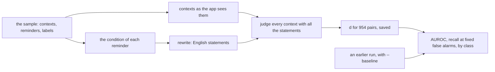
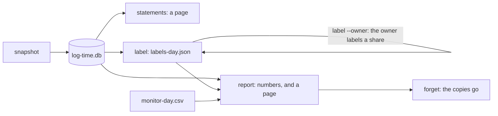

# Evaluation harness

How the app is measured against the thresholds of
[ADR-0003](../adr/0003-acceptance-thresholds.md), on the acceptance day and
whenever the engine changes ([ADR-0017](../adr/0017-evaluation-harness-subpackage.md)).
The code is `jiffin.harness`, run from a checkout with
`uv run python -m jiffin.harness <command>`; `--help` lists the commands and
their options.

## Folders

- **The data folder**, `NO_GIT\jiffin-prove\` beside the repository unless
  `--data` says otherwise, gets everything a command writes. The harness makes
  it only inside a parent that exists.
- **The sample** is the prototype's, `NO_GIT\sibyl-campione\etichette.json`:
  106 real contexts and 9 reminders, with their labels.
- **The model** is the app's pinned file, in the app's `models` folder unless
  `--models` says otherwise. It is checked against its sha256 before the engine
  starts, never downloaded.
- **The engine** is the app's, started through `client` with the app's
  settings, and only when the GPU has 4 GiB free: with the app open there would
  be two engines.

## `sample`

- **As the app sees them**: contexts normalized, the address only in the
  supported browsers and never while the user types in the bar
  ([ADR-0004](../adr/0004-context-identity.md)); each condition is the part of
  the reminder before "ricordami", rewritten by the engine
  ([ADR-0008](../adr/0008-rewrite-conditions-english-statements.md)).
- **The measures** read one threshold on d over all the pairs, since the
  pipeline has one stage ([ADR-0007](../adr/0007-single-stage-pipeline.md)):
  AUROC; the highest recall with at most 0.1, 0.13 and 0.2 false alarms per
  evaluated context, at the lowest threshold that gives it; recall and false
  alarms at the app's threshold; AUROC and recall by class of condition (a name,
  a type of work, a vague wish, a negation).
- **Intervals** are 95%, from 1,000 draws of contexts with replacement. Against
  a baseline both builds get the same draws, so the interval is that of the
  difference.
- **What it writes**: the summary, numbers only, goes to the standard output in
  Markdown; the d of every pair goes to `sample-<time>.json` with the build, as
  the baseline of the next run.

## A day of the app's log

The app's log is its database ([ADR-0013](../adr/0013-sqlite-storage.md)):
every evaluation with the reminders it judged, and every alert. After a day of
use:

- **`snapshot`** copies the database through SQLite's backup API from a
  read-only connection, so the app may be running, into `log-<time>.db`: one
  file, without a write-ahead log beside it. The commands after it read the
  newest copy unless `--copy` names another, migrating a copy of an older app
  as the app would.
- **`forget`** deletes the copies. A copy keeps what the user deletes in the
  app afterwards, so it goes once the analysis is done; labels and pages stay
  in the data folder.
- **`statements`** writes a page with every reminder's condition beside the
  English statement the engine judges, to check on the acceptance day that
  they say the same thing
  ([ADR-0008](../adr/0008-rewrite-conditions-english-statements.md)).
- **A day** is a local day: the last one with evaluations unless `--day` says
  otherwise.

### `label`

- **The pairs** are every (evaluated context, reminder) the engine judged that
  day, into `labels-<day>.json`. A label says whether the reminder's condition
  is true in that context, not whether the reminder would have helped. A pair
  is keyed by its texts (app, title, address, condition), so labels outlive a
  new copy, a replay or another threshold, and preparing the file again keeps
  them.
- **Claude** labels every pair, with the file in front of it, as on 2026-09-28:
  true or false under `claude`, and the keys it is unsure of under
  `uncertain`.
- **The owner** labels a share with `label --owner` (30 pairs unless a number
  follows): the pairs Claude is unsure of first, then others at random. The
  page is served on 127.0.0.1 behind a random token, as the prototype's was; it
  never shows Claude's labels or any score, and saves every answer at once.
- **The label that counts** is the owner's where there is one, Claude's
  elsewhere; the report says how often the two agree.

### `report`

The summary, numbers only, compares the day with the thresholds of
[ADR-0003](../adr/0003-acceptance-thresholds.md); a page in the data folder,
`report-<day>.html`, holds the texts behind the numbers.

| Measure | From |
|---|---|
| Delay, p50 and p95 | each alert on screen: when it appeared, minus when its context came to the foreground |
| Missed reminders | relevant pairs never on screen that day, over all relevant pairs; each with why, from the candidate that came closest: waited for a place, held back by the once-an-hour rule, snoozed, silenced, below the threshold |
| False alarms | alerts on screen whose pair is labelled not relevant |
| Evaluations per hour | the evaluations, over the time from the first context evaluated to the last evaluation; of them, those that asked the engine and those that failed |
| VRAM, RAM, CPU, battery | the day's `monitor` rows, when there are any: VRAM and the RAM of app and engine at their peak, their CPU on average |

The CPU the browsers spend on accessibility cannot be told apart in the
monitor's rows: the benchmark in [context.md](context.md) measures it.

## `monitor`

Every 5 s, until Ctrl+C, a row in `monitor-<day>.csv`: CPU and RAM of the app,
of its engine and of the browsers, the GPU's memory in use, the battery's
charge and whether it is plugged in.

- **Which processes**: `Jiffin.exe` and `jiffin-engine.exe` when packaged
  ([ADR-0015](../adr/0015-package-pyinstaller-velopack.md)), `python -m jiffin`
  and `python -m jiffin.engine` in a checkout; the browsers are Vivaldi, Chrome
  and Brave.
- **CPU** is in percent of the whole machine, from the time each process spent
  since the previous row. **RAM** is the working set, which also counts pages
  shared with other processes. **VRAM** is the whole GPU's: on Windows
  nvidia-smi does not tell it per process.
