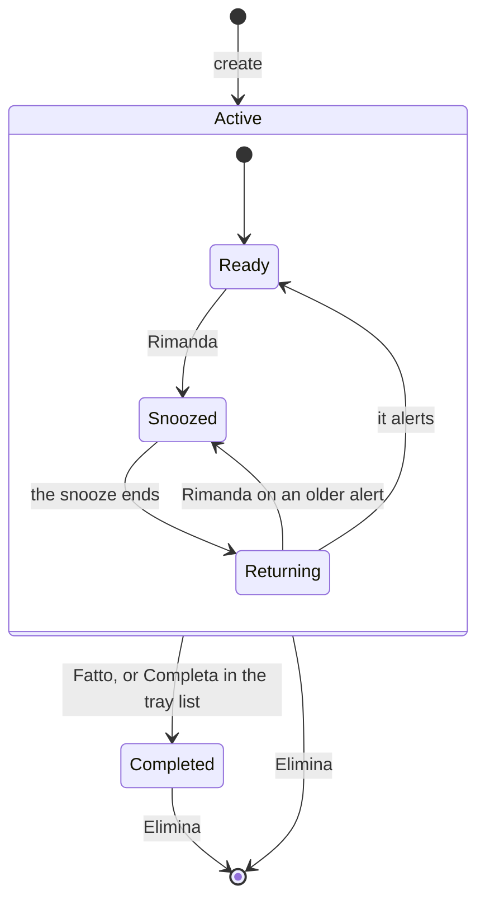
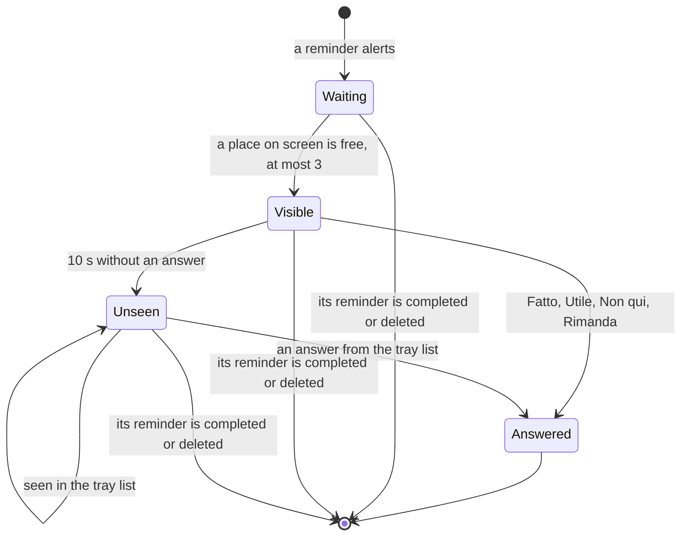

# Lifecycles of reminders and alerts

The states a reminder and an alert go through, in `jiffin.core`. The code is
`core/reminders.py` and `core/alerts.py`; the rules come from decision tickets
[#12](https://github.com/devfrx/jiffin/issues/12) and
[#6](https://github.com/devfrx/jiffin/issues/6), and from
[ADR-0014](../adr/0014-feedback-data-retention.md).

## Reminder

- **Ready**: in a context judged true it alerts, at most once an hour.
- **Snoozed**: it is judged, and keeps quiet. Rimanda lasts 15 minutes, an
  hour, or until "domani": 08:00 of the next day, local time, or of the same day
  when snoozed before 04:00.
- **Returning**: the once-an-hour rule does not apply. If the context is stable
  when the snooze ends, it is judged there at once; otherwise the next context
  judged true brings the alert back.
- **Editing** the text, in any active state, makes a new revision: the
  silences of "Non qui" go, and the reminder is not judged until the engine has
  written the new statement.
- **Non qui** silences one context and changes no state.
- **Completed** reminders are no longer judged, and their open alerts go.
  **Elimina** removes the reminder and everything about it.

## Alert

- An alert waits only when three are already on screen; the tray dot shows
  while one waits, or while one vanished unanswered and the tray list has not
  shown it yet.
- Unseen alerts sit on top of the tray list, newest first.
- The record keeps when the alert appeared, vanished, was seen and answered,
  and the answer: `fatto`, `utile`, `rimanda` or `non_qui`.
