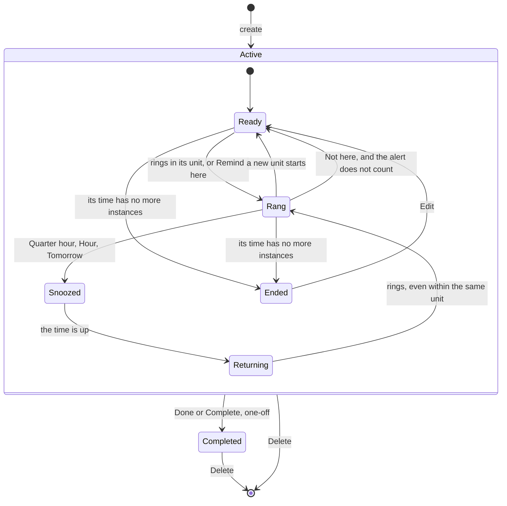
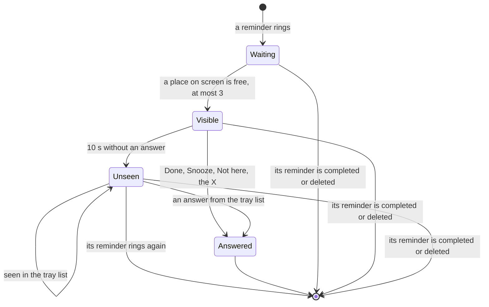

# Lifecycles of reminders and alerts

The states a reminder and an alert go through, in `jiffin.core`. The code is
`core/reminders.py`, `core/units.py` and `core/alerts.py`; the rules come from
[ADR-0021](../adr/0021-one-alert-per-unit.md), which replaced the once-an-hour
rule of decision ticket [#12](https://github.com/devfrx/jiffin/issues/12), from
[ADR-0014](../adr/0014-feedback-data-retention.md) and from
[ADR-0029](../adr/0029-learn-from-answers-per-place.md).

## Reminder

- **The unit.** A reminder rings at most once per unit (`units.by_instance`):
  the **instance of its time** for a reminder with only a time, with a moment
  or a frequency, and with a one-off date, which rings once; with situations
  ([situations.md](situations.md#when-a-reminder-rings)), **each end** for a
  reminder with an end, and **each stretch of its situations**, within its
  time, for one without a remainder; the **occasion** for the others, which
  have a remainder the judge checks. An occasion starts with a true stretch, a
  stable context judged true or answered Remind here, not answered Not here,
  while its time and its situations hold, that begins at least the return
  pause after the last one ended: 2 minutes unless the settings say otherwise.
  An alert asked with Remind here starts a stretch at its time. A duration of
  the thing ("da più di 20 minuti") rings in its occasion once it has lasted
  that long.
- **The windows** (`units.windows`): how long an instance may ring from its
  start.

  | Time | One-off | Perennial |
  |---|---|---|
  | a moment that comes back | until the next moment | until 04:00 |
  | a slot or a whole day that come back | until it ends | the same |
  | with a date | forever, until it has rung | until the instance ends; a moment until 04:00 |
  | a frequency | the windows of its days and hours; the unit is the period | the same |
  | within a period of dates | never after the period | the same |
  | an end of a situation, within the window of its time | until the next end | until 04:00 |

  A moment already past when the condition was written has no window: the
  time counts from when it was written, and Edit keeps that while the
  condition stays the same.
- **Rang**: the reminder waits for its next unit. Each alert counts but those
  answered Not here; one asked with Remind here counts too.
- **Answers per place.** Not here and Remind here are said of a reminder in
  one exact context, its place; the last one said there counts, until the text
  changes. Not here keeps it quiet there. Remind here makes it true there, also
  under its threshold, while its time, Snooze, the occasion and Done still
  hold; if the context is still in front it rings at once, as asked, in any
  state of Active; otherwise the yes holds from the next time there. On a
  reminder without a remainder it just rings. Remind here near the cut
  lowers the reminder's threshold
  ([pipeline.md](pipeline.md#a-threshold-per-reminder)).
  A place can be forgotten, one at a time or all of them (`withdraw`,
  `withdraw_all`): as if never answered there, and the threshold is computed
  again.
- **Snoozed**: it is judged, and keeps quiet. **Returning**: once the snooze is
  over it rings at the first chance, even within the same unit; the reminder
  keeps the end of its snooze, and is returning until it rings again.
- **Ended**: an ended period (`units.ended`) is computed, not stored. A
  reminder with a past date that cannot ring again stays, silent.
- **Editing** the text, in any state, makes a new revision: every answer per
  place is withdrawn, a new condition is read again, a new remainder waits for
  a new statement, and the new text is not true anywhere until it is judged.
  "Ogni volta" alone makes a new revision that keeps the answers.
- **Completed** reminders are no longer judged, and their open alerts go.
  **Delete** removes the reminder and everything about it.
- **After a restart** each reminder goes on from its last alert that counts and
  from its snooze, so the instances of a time stay exact; occasions start
  afresh, and so do the stretches of the situations, from their state read at
  start. The places answered Not here come back; until migration 0003 the
  store keeps neither Remind here, nor the withdrawals, nor a revision's
  situations.
- **A pause from the tray**
  ([ADR-0024](../adr/0024-hold-and-hide-alerts.md)), "Sospendi per un'ora" or
  "Sospendi fino a domani", is away for every reminder: the context in front
  leaves when it starts, and nothing is judged and nothing rings until it ends
  or Resume. Then what is in front comes back as after any absence: occasions
  start again, a late instance or an end that came meanwhile rings, due from
  the return, and a snooze that ended meanwhile rings at the first chance. The
  situations are read and recorded all along. Its end is kept with the
  settings, so it goes on after a restart. Alerts already on screen stay.

## Answers

| Answer | Recorded | Then |
|---|---|---|
| Done, one-off | `fatto` | completed |
| Done, perennial | `fatto` | waits for its next unit |
| Next time | `rimanda`, `next_time` | waits for its next unit; a snooze with a time is lifted |
| Quarter hour, Hour, Tomorrow | `rimanda`, with its kind | snoozed, then returning |
| Not here | `non_qui`, and the place: `not_here` | silent in that context until the text changes; the alert does not count |
| Remind here | the place: `remind_here` | true in that context until the text changes; rings at once if it is still in front |
| the X | `chiuso` | waits for its next unit; not among the unseen |
| 10 s without an answer | nothing | waits for its next unit; among the unseen |

Tomorrow ends at 08:00 of the next day, local time, or of the same day when
snoozed before 04:00; so does the pause until tomorrow. `utile`, the answer
of version 0.1 that Next time replaced, stays in older rows.

## Alert

- An alert waits only when three are already on screen; the tray dot shows
  while one waits, or while one vanished unanswered and the tray list has not
  shown it yet.
- The tray list keeps one unseen alert per reminder, the newest, on top, newest
  first: when a reminder rings again, its old one leaves unanswered, and does
  not come back after a restart.
- An alert of a reminder without a remainder, with only a time or situations,
  has no evaluation and no d.
- An alert asked with Remind here is `requested`: it has no evaluation, so it
  is never the judge's; its d is the one the cache holds there, and it was due
  when asked.
- The record keeps when the alert was due and made, appeared, vanished, was
  seen and answered, the answer and the kind of its Snooze.
