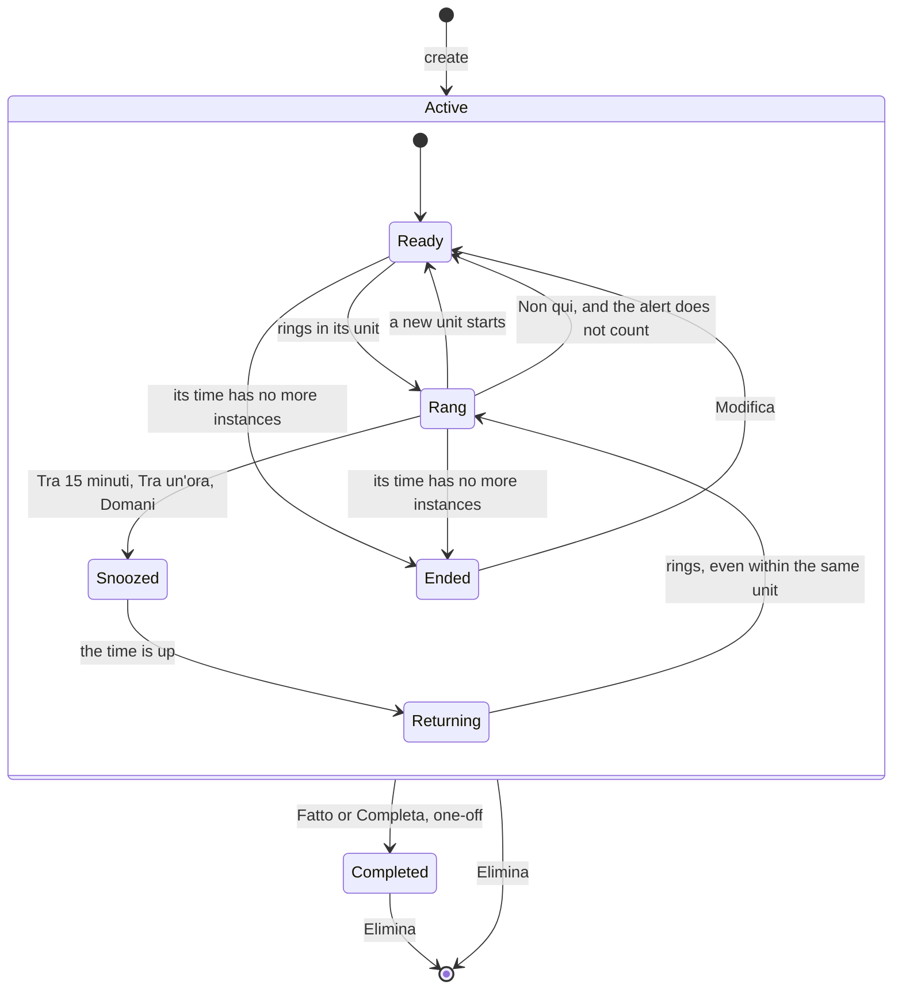

# Lifecycles of reminders and alerts

The states a reminder and an alert go through, in `jiffin.core`. The code is
`core/reminders.py`, `core/units.py` and `core/alerts.py`; the rules come from
[ADR-0021](../adr/0021-one-alert-per-unit.md), which replaced the once-an-hour
rule of decision ticket [#12](https://github.com/devfrx/jiffin/issues/12), and
from [ADR-0014](../adr/0014-feedback-data-retention.md).

## Reminder

- **The unit.** A reminder rings at most once per unit (`units.by_instance`):
  the **instance of its time** for a reminder with only a time, with a moment
  or a frequency, and with a one-off date, which rings once; the **occasion**
  for the others, which have a remainder the judge checks. An occasion starts
  with a true stretch, a stable context judged true, not silenced, while its
  time holds, that begins at least the return pause after the last one ended:
  2 minutes unless the settings say otherwise.
- **The windows** (`units.windows`): how long an instance may ring from its
  start.

  | Time | One-off | Perennial |
  |---|---|---|
  | a moment that comes back | until the next moment | until 04:00 |
  | a slot or a whole day that come back | until it ends | the same |
  | with a date | forever, until it has rung | until the instance ends; a moment until 04:00 |
  | a frequency | the windows of its days and hours; the unit is the period | the same |
  | within a period of dates | never after the period | the same |

  A moment already past when the condition was written has no window: the
  time counts from when it was written, and Modifica keeps that while the
  condition stays the same.
- **Rang**: the reminder waits for its next unit. Each alert counts but those
  answered "Non qui".
- **Snoozed**: it is judged, and keeps quiet. **Returning**: once the snooze is
  over it rings at the first chance, even within the same unit; the reminder
  keeps the end of its snooze, and is returning until it rings again.
- **Ended**: an ended period (`units.ended`) is computed, not stored. A
  reminder with a past date that cannot ring again stays, silent.
- **Editing** the text, in any state, makes a new revision: the silences of
  "Non qui" go, a new condition is read again, a new remainder waits for a new
  statement, and the new text is not true anywhere until it is judged.
  "Ogni volta" alone makes a new revision that keeps the silences.
- **Completed** reminders are no longer judged, and their open alerts go.
  **Elimina** removes the reminder and everything about it.
- **After a restart** each reminder goes on from its last alert that counts and
  from its snooze, so the instances of a time stay exact; occasions start
  afresh.

## Answers

| Answer | Recorded | Then |
|---|---|---|
| Fatto, one-off | `fatto` | completed |
| Fatto, perennial | `fatto` | waits for its next unit |
| Alla prossima volta | `rimanda`, `next_time` | waits for its next unit; a snooze with a time is lifted |
| Tra 15 minuti, Tra un'ora, Domani | `rimanda`, with its kind | snoozed, then returning |
| Non qui | `non_qui` | silent in that context until the text changes; the alert does not count |
| the X | `chiuso` | waits for its next unit; not among the unseen |
| 10 s without an answer | nothing | waits for its next unit; among the unseen |

"Domani" ends at 08:00 of the next day, local time, or of the same day when
snoozed before 04:00. Until the alert of version 0.2
([#102](https://github.com/devfrx/jiffin/issues/102)) the interface still has
Utile, which `app` sends as Alla prossima volta; `utile` stays in older rows.

## Alert

- An alert waits only when three are already on screen; the tray dot shows
  while one waits, or while one vanished unanswered and the tray list has not
  shown it yet.
- The tray list keeps one unseen alert per reminder, the newest, on top, newest
  first: when a reminder rings again, its old one leaves unanswered, and does
  not come back after a restart.
- An alert of a reminder with only a time has no evaluation and no d.
- The record keeps when the alert was due and made, appeared, vanished, was
  seen and answered, the answer and the kind of its Rimanda.
