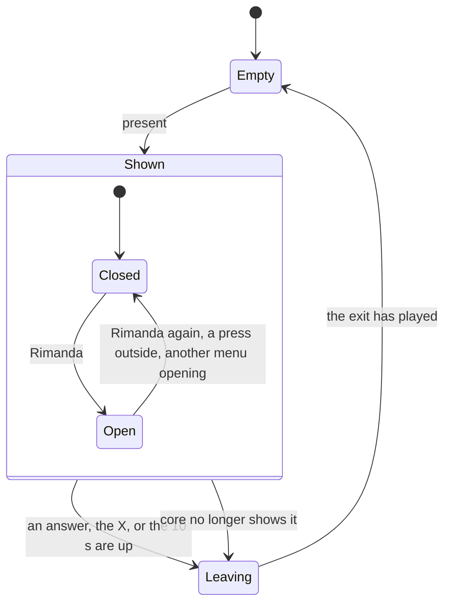

# The alert overlay

How an alert reaches the screen and comes back as an answer, in `jiffin.ui`.
`ui/overlay.py` places the alerts and their menus, `ui/alert.py` holds each
one's state, `qml/AlertWindow.qml` and `qml/AlertMenu.qml` draw them, and
`ui/look.py` and `ui/glass.py` give them Windows' settings and materials. The
behaviour comes from decision tickets
[#12](https://github.com/devfrx/jiffin/issues/12) and
[#83](https://github.com/devfrx/jiffin/issues/83), the line from
[#84](https://github.com/devfrx/jiffin/issues/84), the look from
[ADR-0010](../adr/0010-windows-11-look-own-components.md), the X from
[ADR-0023](../adr/0023-window-frame.md), the capture from
[ADR-0024](../adr/0024-hold-and-hide-alerts.md), the focus rules from
[ADR-0009](../adr/0009-qt-quick-pyside6-interface.md); the
[mockup](mockups/overlay.html) shows it in light and dark.

## Placement

- `core` says which alerts are on screen, at most three
  ([lifecycles](lifecycles.md)). The overlay gives each a window at the top
  centre of the primary screen's work area, 12 px from the top and 8 px apart,
  oldest first; when one leaves, those below move up.
- The three windows are made at start, each with its menu, and stay hidden
  until needed: each has its native handle, and its glass, before it first
  shows.
- A window shown without activation keeps the place it had among the windows
  always on top: a menu went under the alert below, shown later. So each
  window, as it shows, goes over them all, and an open menu goes back over a
  new alert.
- An alert answered here, or vanished, never shows again, even when a view of
  `core` from before the answer arrives later. A new alert waits until a window
  has finished leaving.

## One alert

- **The line**: the condition without its time, then the time understood,
  written for the day it shows on: "Quando apro Claude · dalle 23:00 alle
  04:00". Every day goes unsaid, also for a perennial reminder, whose icon says
  it. With only a time, the day of the instance it rings for and its hours:
  "Oggi alle 15:00", or "Ieri alle 15:00" when it rings late
  (`units.instance_day`, from the window that holds the moment it rang).
- **The icon**: Document, or RepeatAll for a perennial reminder, whose Fatto
  means "done this time".
- **The commands**: Fatto, Rimanda and the X. The X closes without an answer,
  and `core` records `chiuso` ([ADR-0021](../adr/0021-one-alert-per-unit.md)).
- **Rimanda's menu**: Alla prossima volta, Tra 15 minuti, Tra un'ora, Domani, a
  line, Non qui. Alla prossima volta shows only when the reminder has a next
  unit: `core`'s `next_occasion`, asked when the menu opens. The menu is a
  window of its own under the button, on its left edge and 4 px down, as wide
  as its longest item and 32 px, 120 px at least: WinUI's MenuFlyout, with 4 px
  around the items, 2 px between them and items of 32 px. It covers the alerts
  below for a moment, and follows its alert when that moves up. One menu is
  open at a time. `AlertMenu.qml` knows only its items: it says which one was
  chosen, and the window that holds it places it and answers; the tray list's
  unseen alerts open the same menu ([tray](tray.md)).
- The menu closes on a second click on Rimanda, on a press outside it and its
  alert, or when the alert leaves. Its windows never take the focus, so they
  hear of no click elsewhere: while a menu is open, and only then, the overlay
  reads the mouse buttons every 20 ms (`GetAsyncKeyState`, left or right, so
  also with the buttons swapped). A press that began inside, or a button
  already down when the menu opened, does not count.
- The 10 s pause while the mouse is over the alert or its menu is open. When
  they are up, the alert goes to `core` as vanished.
- Each answer goes to `core` once: a click while the window leaves is ignored.
  An empty slot ignores the mouse, since Qt sends an enter and a leave after
  `hide()`.
- The windows never take the focus: `Qt::WindowDoesNotAcceptFocus`, tool
  windows always on top, buttons with no focus of their own.

## Out of screen capture

- Alerts and menus come uninvited, so they are kept out of screen capture
  while they show: `SetWindowDisplayAffinity` with `WDA_EXCLUDEFROMCAPTURE`
  before each `show()`, so that no frame of them is captured, and `WDA_NONE`
  after each `hide()`, so that nothing is excluded while no alert shows.
  Shared screens, recordings and screenshots show what is under them; the
  user's monitor shows them.
- A refusal from Windows leaves the window visible, the mistake that shows, and
  its error code goes to the log.

## Look and glass

- The look follows Windows while the app runs. Theme and accent come from Qt;
  transparency and animations from Windows' messages, read again 1 s after the
  last one. After a change of theme, accent or transparency, the glass is
  recreated once; other setting changes leave it alone.
- The material is B by default: Acrylic with the veil of Windows' menus. With
  transparency off, the surface is solid and painted by QML. Menus have their
  alert's material.
- The windows get a frame they never show, and DWM always sees it active: the
  recipe is in ADR-0010.

## Trying it

`uv run python -m jiffin.ui --alerts 3 --material b` shows made-up alerts, one
without a time, one perennial with a time and one with only a time, without the
model or any data; each answer is printed, and a new alert comes 2 s later. The
unit tests run the windows on Qt's offscreen platform (`tests/unit/ui`); the
focus test of ADR-0009, on the owner's machine, is
`tests/integration/test_ui.py`, and answers through the menu too.
