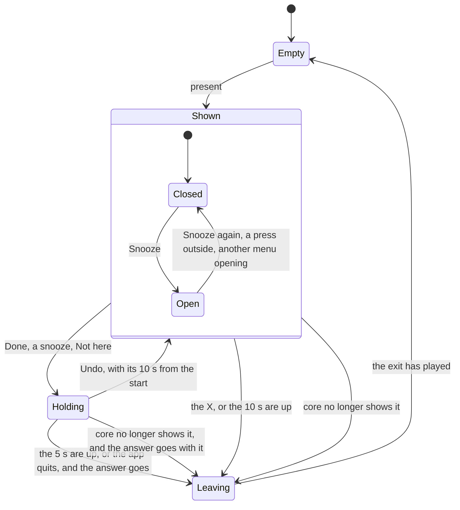
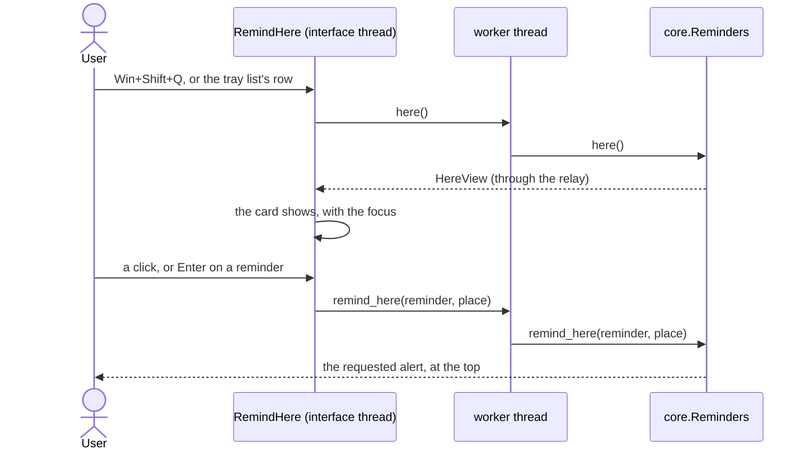

# The alert overlay

How an alert reaches the screen and comes back as an answer, in `jiffin.ui`.
`ui/overlay.py` places the alerts and their menus, `ui/alert.py` holds each
one's state, `qml/AlertWindow.qml` and `qml/AlertMenu.qml` draw them, and
`ui/look.py` and `ui/glass.py` give them Windows' settings and materials. The
card of Remind here, which goes over them, is `ui/remind_here.py` and
`qml/RemindHereWindow.qml`. The behaviour comes from decision tickets
[#12](https://github.com/devfrx/jiffin/issues/12) and
[#83](https://github.com/devfrx/jiffin/issues/83), the line from
[#84](https://github.com/devfrx/jiffin/issues/84), the look from
[ADR-0010](../adr/0010-windows-11-look-own-components.md), the X from
[ADR-0023](../adr/0023-window-frame.md), the capture from
[ADR-0024](../adr/0024-hold-and-hide-alerts.md), the focus rules from
[ADR-0009](../adr/0009-qt-quick-pyside6-interface.md), the card from
[ADR-0029](../adr/0029-learn-from-answers-per-place.md), Undo from
[ADR-0030](../adr/0030-undo-and-reopen.md), the situations' words from
[ADR-0028](../adr/0028-read-the-situations-in-core.md) and
[#153](https://github.com/devfrx/jiffin/issues/153); the
[mockup](mockups/overlay.html) shows them in light and dark.

## Placement

- `core` says which alerts are on screen, at most three
  ([lifecycles](lifecycles.md)). The overlay gives each a window at the top
  centre of the primary screen's work area, 12 px from the top and 8 px apart,
  oldest first; when one leaves, those below move up.
- The three windows are made at start, each with its menu, and stay hidden
  until needed: each has its native handle, and its glass, before it first
  shows.
- A window shown without activation keeps the place it had among the windows
  always on top: a menu went under the alert below, shown later. So each
  window, as it shows, goes over them all, and an open menu goes back over a
  new alert.
- An alert answered here, or vanished, never shows again, even when a view of
  `core` from before the answer arrives later. A new alert waits until a window
  has finished leaving.
- While the card of Remind here shows, it is at the top, 12 px from the top
  of the work area, and the alerts on screen move down under it, 8 px apart,
  as when a new one comes; they move back up when it hides. The card is put in
  place before it shows, since the work area may have moved.

## One alert

- **The line**: the condition without its time, its situations after a dot
  ([the situations' words](situations.md#writing-them)), then the time
  understood, written for the day it shows on: "Quando apro Claude · dalle
  23:00 alle 04:00", "Quando apro Outlook · alla fine della call", "All'uscita
  di casa". Every day goes unsaid, also for a perennial reminder, whose icon says
  it. With only a time, the day of the instance it rings for and its hours:
  "Oggi alle 15:00", or "Ieri alle 15:00" when it rings late
  (`units.instance_day`, from the window that holds the moment it rang).
- **The icon**: Document, or RepeatAll for a perennial reminder, whose Done
  means "done this time".
- **The commands**: Done, Snooze and the X. The X closes without an answer,
  and `core` records `chiuso` ([ADR-0021](../adr/0021-one-alert-per-unit.md)).
- **Snooze's menu**: Next time, Quarter hour, Hour, Tomorrow, a
  line, Not here. Next time shows only when the reminder has a next
  unit: `core`'s `next_occasion`, asked when the menu opens. The menu is a
  window of its own under the button, on its left edge and 4 px down, as wide
  as its longest item and 32 px, 120 px at least: WinUI's MenuFlyout, with 4 px
  around the items, 2 px between them and items of 32 px. It covers the alerts
  below for a moment, and follows its alert when that moves up. One menu is
  open at a time. `AlertMenu.qml` knows only its items: it says which one was
  chosen, and the window that holds it places it and answers; the tray list's
  unseen alerts open the same menu ([tray](tray.md)).
- The menu closes on a second click on Snooze, on a press outside it and its
  alert, or when the alert leaves. Its windows never take the focus, so they
  hear of no click elsewhere: while a menu is open, and only then, the overlay
  reads the mouse buttons every 20 ms (`GetAsyncKeyState`, left or right, so
  also with the buttons swapped). A press that began inside, or a button
  already down when the menu opened, does not count.
- The 10 s pause while the mouse is over the alert or its menu is open. When
  they are up, the alert goes to `core` as vanished.
- **Undo** ([ADR-0030](../adr/0030-undo-and-reopen.md)): Done, the four
  snoozes and Not here wait 5 s before they go to `core`. In place of the
  buttons and the X the alert shows the answer's name in the secondary colour
  ("Fatto", "Tra 15 minuti", "Non qui"…) and **Undo**; the bar of the 10 s
  becomes one of 5 s, which the mouse over the alert does not stop, since it is
  there right after the click. Undo puts the alert back as it was, with its
  10 s from the start, which stop again under the mouse. Then the answer goes,
  and the alert leaves with its name; the X and the 10 s leave at once, since
  they change nothing. When the app quits, a waiting answer goes at once,
  before the worker stops (`Overlay.close`); when `core` no longer shows the
  alert, since its reminder was completed or deleted in the tray list
  meanwhile, the answer goes with it. The slot keeps the answer and its state;
  the window shows them and times the 5 s, as the 10 s.
- Each answer goes to `core` once: a click while it waits or leaves is ignored.
  An empty slot ignores the mouse, since Qt sends an enter and a leave after
  `hide()`.
- The windows never take the focus: `Qt::WindowDoesNotAcceptFocus`, tool
  windows always on top, buttons with no focus of their own.

## The card of Remind here

"Qui dovevi avvisarmi" ([ADR-0029](../adr/0029-learn-from-answers-per-place.md)):
the user says which reminder should have rung in the last place Jiffin
judged, and Jiffin learns it there.

- **Opening it**: Win+Shift+Q from any app ([creation](creation.md)), or the
  row at the top of the tray list ([tray](tray.md)). The card asks `core`
  what it shows, through the worker's queue, and shows when the answer comes:
  after the worker's turn under way, which an engine call may stretch to a few
  seconds. `core` computes it when asked, since what kept each reminder quiet
  changes with the time, the snoozes and the answers.
- **The place** is the last context stable for 5 s
  ([ADR-0019](../adr/0019-five-second-debounce.md)); Jiffin's windows are no
  place, so from the tray list it is the window before. The card writes it in
  the small line over its question: the window's title, and the site in a
  browser ("Preventivi · mail.google.com"); a wrong place shows. With no place
  yet (Jiffin has just started, or only private or full-screen windows stayed
  in front), it says so and lists nothing; with no active reminder, it says
  that.
- **Drawn like an alert**, 540 px wide, on the same glass: the bell (Ringer)
  where the alert has its icon, the place, "Qui dovevi avvisarmi di…" in bold
  and the X. Under it the active reminders, in `core`'s order there: the
  judged ones, the closest to ringing first, then those not judged there, then
  those with only a time, the newest first. Each row has the action, then the
  condition without its time, its situations after it, as on the alert (or
  the time, for one with only a time), and after a dot what else kept it
  quiet there: "Taciuto qui", "Già suonato", "Rimandato", "Fuori orario",
  "Periodo finito", "Fuori situazione"; never a number. "Fuori situazione",
  for a situation that does not hold, an end not come or a duration not
  reached, is the owner's choice on #153's trial, with the whole condition in
  view ("Quando apro Steam · a casa · Fuori situazione"), as a sibling of
  "Fuori orario". It grows down to 12 px from the bottom of the work area,
  then the list scrolls under the question.
- **It takes the focus**, unlike the alerts, since the user asked for it, and
  shows with no entrance, as the tray list does. Up and Down move over the
  reminders, round from the last to the first, with WinUI's focus ring and
  starting on none, as a menu opened by the mouse; Enter or Space choose. Esc,
  the X, or the focus going to another window (a click elsewhere, Alt+Tab)
  close it, and Windows gives the focus back to the window before. A click on
  an alert while the card shows goes to the alert, which never takes the
  focus: the card stays.
- **A pick** is Remind here, in the place the card shows: the card closes,
  and `core` rings the reminder's alert at once if that place is still the one
  in front, also when it rang already, was snoozed or is out of its time,
  marked as requested; else the yes holds from the next time there. It rings
  during a pause from the tray too, for the window in front before it: the
  pause holds the alerts that come uninvited
  ([ADR-0024](../adr/0024-hold-and-hide-alerts.md)), and this one was asked
  for (the owner's choice on #151's check).

## Out of screen capture

- Alerts and menus come uninvited, so they are kept out of screen capture
  while they show: `SetWindowDisplayAffinity` with `WDA_EXCLUDEFROMCAPTURE`
  before each `show()`, so that no frame of them is captured, and `WDA_NONE`
  after each `hide()`, so that nothing is excluded while no alert shows.
  Shared screens, recordings and screenshots show what is under them; the
  user's monitor shows them.
- A refusal from Windows leaves the window visible, the mistake that shows, and
  its error code goes to the log.
- The card of Remind here is opened by the user, as the tray list: screen
  capture sees it.

## Look and glass

- The look follows Windows while the app runs. Theme and accent come from Qt;
  transparency and animations from Windows' messages, read again 1 s after the
  last one. After a change of theme, accent or transparency, the glass is
  recreated once; other setting changes leave it alone.
- The material is B by default: Acrylic with the veil of Windows' menus. With
  transparency off, the surface is solid and painted by QML. Menus have their
  alert's material.
- The windows get a frame they never show, and DWM always sees it active: the
  recipe is in ADR-0010.

## Trying it

`uv run python -m jiffin.ui --alerts 3 --material b` shows made-up alerts, one
without a time, one perennial with a time and one with only a time, without the
model or any data; each answer is printed once its 5 s are over, and a new
alert comes 2 s later; one left to vanish brings no new one.
Win+Shift+Q opens the card on a made-up place, each reminder kept quiet in a
way of its own; `--no-place` opens it with no place yet. The unit tests run
the windows on Qt's offscreen platform (`tests/unit/ui`); the focus test of
ADR-0009, on the owner's machine, is `tests/integration/test_ui.py`, which
answers through the menu too and picks on the card by keyboard.
