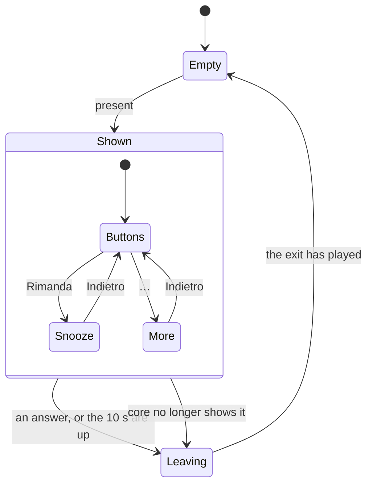

# The alert overlay

How an alert reaches the screen and comes back as an answer, in `jiffin.ui`.
`ui/overlay.py` places the alerts, `ui/alert.py` holds each one's state,
`qml/AlertWindow.qml` draws it, and `ui/look.py` and `ui/glass.py` give it
Windows' settings and materials. The behaviour comes from decision ticket
[#12](https://github.com/devfrx/jiffin/issues/12), the look from
[ADR-0010](../adr/0010-windows-11-look-own-components.md), the focus rules
from [ADR-0009](../adr/0009-qt-quick-pyside6-interface.md); the
[mockup](mockups/overlay.html) shows it in light and dark.

## Placement

- `core` says which alerts are on screen, at most three
  ([lifecycles](lifecycles.md)). The overlay gives each a window at the top
  centre of the primary screen's work area, 12 px from the top and 8 px apart,
  oldest first; when one leaves, those below move up.
- The three windows are made at start and stay hidden until needed: each has
  its native handle, and its glass, before it first shows.
- An alert answered here, or vanished, never shows again, even when a view of
  `core` from before the answer arrives later. A new alert waits until a window
  has finished leaving.

## One alert

- **Buttons**: Fatto, Rimanda and "…". **Snooze**: Indietro, 15 min, 1 ora
  and Domani. **More**: Indietro, Utile and Non qui. The panels open inside the
  alert, since a menu window could take the focus. Until the alert of 0.2
  ([#102](https://github.com/devfrx/jiffin/issues/102)), Utile reaches `core` as
  Alla prossima volta ([ADR-0021](../adr/0021-one-alert-per-unit.md)).
- The 10 s pause while the mouse is over the alert or a panel is open. When
  they are up, the alert goes to `core` as vanished.
- Each answer goes to `core` once: a click while the window leaves is ignored.
  An empty slot ignores the mouse, since Qt sends an enter and a leave after
  `hide()`.
- The window never takes the focus: `Qt::WindowDoesNotAcceptFocus`, a tool
  window always on top, buttons with no focus of their own.

## Look and glass

- The look follows Windows while the app runs. Theme and accent come from Qt;
  transparency and animations from Windows' messages, read again 1 s after the
  last one. After a change of theme, accent or transparency, the glass is
  recreated once; other setting changes leave it alone.
- The material is B by default: Acrylic with the veil of Windows' menus. With
  transparency off, the surface is solid and painted by QML.
- The windows get a frame they never show, and DWM always sees it active: the
  recipe is in ADR-0010.

## Trying it

`uv run python -m jiffin.ui --alerts 3 --material b` shows made-up alerts,
without the model or any data; each answer is printed, and a new alert comes
2 s later. The unit tests run the windows on Qt's offscreen platform
(`tests/unit/ui`); the focus test of ADR-0009, on the owner's machine, is
`tests/integration/test_ui.py`.
