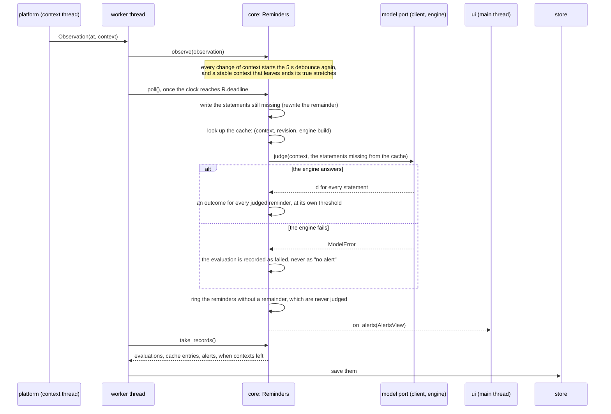

# Judging pipeline

How a context in the foreground becomes an alert, in `jiffin.core`
([ADR-0007](../adr/0007-single-stage-pipeline.md),
[ADR-0012](../adr/0012-package-structure-ports.md),
[ADR-0021](../adr/0021-one-alert-per-unit.md),
[ADR-0028](../adr/0028-read-the-situations-in-core.md),
[ADR-0029](../adr/0029-learn-from-answers-per-place.md)). The code is
`core/reminders.py`; the debounce is `core/debounce.py`, the units and the
windows of a time `core/units.py`, the situations over time
`core/situations.py` ([situations.md](situations.md)).

While a context stays stable, the same steps run again, from the cache, for
the reminders whose snooze ends or whose time starts or ends: "quando apro
Claude dopo le 23", with Claude in front since 22:30, rings at 23:00. So they
do when a change of a situation counts, 5 s after it came, for the reminders
on that situation, and when a duration of their situations is reached: "quando
sono a casa e apro Steam", with Steam in front, rings when the user is home.

## The outcome of a judged reminder

Every active reminder whose revision has a statement is judged in every stable
context, also out of its time, so that its score is in the cache when its time
comes. The first outcome that applies is recorded with the evaluation:

1. **below threshold**: d is under the reminder's threshold, and the user did
   not say Remind here in this exact context;
2. **outside time**: true, but its time does not hold now;
3. **outside situation**: true and within its time, but a situation of it does
   not hold, an end has not come or a duration is not reached
   ([situations.md](situations.md#when-a-reminder-rings));
4. **silenced**: Not here is what counts in this exact context;
5. **snoozed**: its snooze with a time has not ended;
6. **same occasion**: it has rung already in its unit, and no snooze has ended
   since ([lifecycles.md](lifecycles.md));
7. **alert**.

`held_back`, the once-an-hour rule of version 0.1, stays only in its rows. A
reminder without a remainder, with only a time or situations, rings in any
stable context while its time and its situations hold, unless silenced there,
snoozed or rung in its unit: it has no evaluation and no d, and rings while
the engine is down.

An alert records when it became due: the arrival of its context, the start of
its time, when its situations made it due (the start of a stretch, an end, a
duration reached) or the end of its snooze, whichever came last
([ADR-0022](../adr/0022-acceptance-thresholds-v0-2.md)).

## A threshold per reminder

`THRESHOLD` (0.97) is tied to the engine's model and prompts, and was kept on
the acceptance day of 0.2; only the harness replays a day at another, and the
evaluation records it. Each reminder judges at its own threshold
([ADR-0029](../adr/0029-learn-from-answers-per-place.md)): `THRESHOLD` less
0.25 (`STEP_DOWN`) for every two Remind here near the cut, where its d was at
most 1 (`NEAR_CUT`) under `THRESHOLD`, said with the engine build in use; 0.5
(`MOST_DOWN`) under it at most. It never goes up. Farther from the cut, a
Remind here makes the reminder true only in its place. The threshold is
computed again from the answers at every judgement and never kept: a
withdrawal, a new text or a new build puts it back exactly.

**Remind here** in a context still in front rings at once, as asked: a
`requested` alert with no evaluation, the d the cache holds there and due when
asked, also when the reminder rang already in its unit, was snoozed or out of
its time. It counts in its unit and starts a true stretch at its time, ended at
once unless its context is the stable one, so that coming back right after the
card rings no second alert. "In front" is the last context in front for the
reminders: Jiffin's windows, which the capture observes as no context, do not
take it away, nor does a pause, which holds only the alerts that come
uninvited ([ADR-0024](../adr/0024-hold-and-hide-alerts.md)): a Remind here
during a pause rings at once. A context no longer in front waits for the next
time there.

## Driving `Reminders`

- **Worker thread.** One event at a time: `observe()` for every observation,
  of the window in front or of a situation; `poll()` when the clock reaches
  `deadline`, the earliest of the debounce, a change of a situation that
  counts, the snooze ends and, while a context is stable, the next start or end
  of each reminder's time or a duration of its situations reached; the user's
  commands. Between events it waits on its queue until `deadline`. Every call
  handles the deadlines already due first, so a late `poll()` loses nothing,
  and a change of a situation before a context that becomes stable at the same
  moment. When the app closes, the worker observes "no context", so the context
  in front leaves with it, and each situation as not read, at the same time:
  their stretches end with the app ([context](context.md#the-situations)).
- **The engine's sleep.** After every event the worker reads `need` and
  passes it to the engine's supervisor
  ([ADR-0027](../adr/0027-light-sleep-of-the-engine.md),
  [engine](engine.md#supervision)): soon, while the context waiting for its 5 s
  has a judgement not in the cache, a revision without its statement
  included; nothing in front, with no context or during the pause; not now
  otherwise. `core` does not know that the engine sleeps, but it records each
  stretch with nothing in front, the first from when it starts until the
  capture's first window, so that the harness can check that the engine slept
  ([ADR-0031](../adr/0031-acceptance-thresholds-v0-3.md)).
- **Store.** After every event, `take_records()` returns what changed, in
  saving order: reminders (with their current revision), deletions, answers
  per place and their withdrawals, cache entries, evaluations, when a stable
  context left, when nothing came in front and when something came back, the
  stretches of the situations that ended, alerts. The worker adds the engine's
  sleeps, which `core` never sees. `Store.save()` keeps them in one
  transaction: records with an id replace the previous record with that id, a
  cache entry replaces the one with the same context, revision and engine
  build, the end of a sleep or of a stretch with nothing in front replaces its
  start, and when a context left goes on the evaluations of that stretch;
  every answer per place is a row of its own. At startup, `Reminders` starts from `Store.load()`, with the return
  pause the worker reads in the settings (2 minutes by default); a new one from
  the settings is in force at once, for the stretches that start after it.
  The schema is in [data-model.md](data-model.md).
- **Interface.** `on_alerts` receives an `AlertsView` after every change, on
  the worker thread: the alerts on screen (at most 3), how many wait, and those
  that vanished unanswered, one per reminder. `on_reminders` receives a
  `RemindersView` after every change of a reminder or of its answers, and when
  the model is ready: the active reminders, newest first, each with the places
  of its answers, the last answered first, and whether its threshold went down
  with the build in use. The interface answers with `done`, `snooze` (with its
  kind), `not_here`, `close` (the X), `vanished` (its own 10 s timer) and
  `seen` (the tray list is open), and changes the reminders with `create`,
  `edit` (both with "Ogni volta"), `complete` and `delete`. Commands about
  something already gone do nothing. Whether Next time has a unit to wait for,
  and whether a period has ended, are pure functions of `core/units.py` it may
  call itself: `next_occasion` and `ended`.
- **Remind here.** `core` takes `remind_here` (a reminder, a context),
  `withdraw` (a reminder, a context) and `withdraw_all` (a reminder), and gives
  `here()`: the place, the last context stable for 5 s, which stays the place
  while one of Jiffin's windows is in front; and the active reminders, those
  judged there first, by their d there less their threshold, then those not
  judged there and those with only a time, the newest first; each with what
  else keeps it quiet there now: its time, Not here, a snooze, or a ring in its
  unit.
- **Model port.** `build()` names the engine that answers, also while it
  restarts or sleeps; `judge()` scores every statement it gets; `rewrite()`
  turns a remainder into its statement; a call while the engine sleeps waits
  for it to wake; any failure is a `ModelError`.
- **Harness.** A replay moves the simulated clock to the next observation or
  `deadline`, whichever comes first, so every evaluation happens at its exact
  time.
