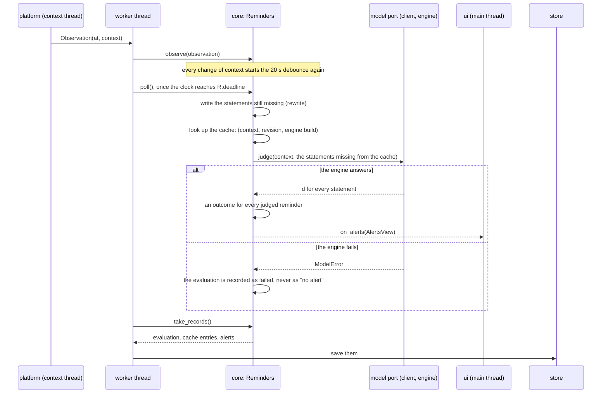

# Judging pipeline

How a context in the foreground becomes an alert, in `jiffin.core`
([ADR-0007](../adr/0007-single-stage-pipeline.md),
[ADR-0012](../adr/0012-package-structure-ports.md)). The code is
`core/reminders.py`; the debounce is `core/debounce.py`.

When a snooze ends while the context is stable, the same steps run for that
reminder alone.

## The outcome of a judged reminder

Checked in this order; the first that applies is recorded with the evaluation:

1. **below threshold**: d < `THRESHOLD` (0.97, a constant tied to the engine's
   model and prompts);
2. **silenced**: "Non qui" was answered in this exact context;
3. **snoozed**: its snooze has not ended;
4. **held back**: it alerted less than an hour ago, and no snooze has ended
   since;
5. **alert**.

Only active reminders whose revision has a statement are judged.

## Driving `Reminders`

- **Worker thread.** One event at a time: `observe()` for every observation;
  `poll()` when the clock reaches `deadline`, the earliest of the debounce and
  the snooze ends; the user's commands. Between events it waits on its queue
  until `deadline`. Every call handles the deadlines already due first, so a
  late `poll()` loses nothing.
- **Store.** After every event, `take_records()` returns what changed, in
  saving order: reminders (with their current revision), deletions, silences,
  cache entries, evaluations, alerts. Records with an id replace the previous
  record with that id; a cache entry replaces the one with the same context,
  revision and engine build.
- **Interface.** `on_alerts` receives an `AlertsView` after every change, on
  the worker thread: the alerts on screen (at most 3), how many wait, and those
  that vanished unanswered. The interface answers with `done`, `useful`,
  `not_here`, `snooze`, `vanished` (its own 10 s timer) and `seen` (the tray
  list is open). Commands about something already gone do nothing.
- **Model port.** `build()` names the engine that answers, also while it
  restarts; `judge()` scores every statement it gets; any failure is a
  `ModelError`.
- **Harness.** A replay moves the simulated clock to the next observation or
  `deadline`, whichever comes first, so every evaluation happens at its exact
  time.
