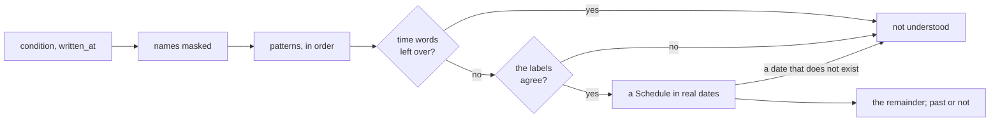

# Reading the time

How Jiffin reads the time of a condition: "quando apro Claude dopo le 23",
"alle 15", "il primo lunedì del mese"
([ADR-0020](../adr/0020-read-the-time-in-core.md)), and how it writes it
back. The reading is in `core`, pure, with no dependency but the lexicon:
`grammar.py` finds the time words and labels them, `meanings.py` turns the
labels into a `Schedule` with every decided meaning and has `read`, the only
way in, and `schedule.py` holds the `Schedule` and its calendar. The writing
is in `ui/words.py`. Both take their words from the lexicon, `time.toml`.
`read` reads the situations of a condition too, first, and sets them aside:
see [situations.md](situations.md).

## The stages

1. **Names masked.** Names are not time: quoted names, words with a digit or
   a dot inside ("report-9.xlsx"), capitalized words after the first
   ("Corriere della Sera", "zia Domenica"), the number after a name
   ("Windows 11"), a number that counts something ("alle 20 pagine", "le 8
   ore di lavoro"), and a time that names a thing ("il treno delle 7:40").
   The masked text keeps its length, so the offsets of a match are those of
   the condition.
2. **Patterns.** A closed list of forms, tried in order; a match may not
   overlap an earlier one. A match gives labels: what the words say, not yet
   what they mean ("lunedì" is the next Monday, "il lunedì" every Monday).
3. **Left over.** Time words outside the matches ("verso sera", "a dicembre",
   "il 15" without its month), or a word beside a match that changes it
   ("prima di lunedì", "il weekend prossimo", an ordinal as in "il secondo
   lunedì" or "l'ultimo venerdì", also across "e": "prima e dopo cena"), make
   the time not understood: it is never guessed.
4. **Agree.** One label of each kind: days, hours, a period, a frequency. Two
   of a kind, or kinds that do not go together (a date and a period, "tra 2
   ore" and anything else), make the time not understood.
5. **A Schedule in real dates**, counted from `written_at`: "domani", "tra 2
   ore", "fino a domenica" and the start of a frequency are dates from there
   on. A date that does not exist ("il 31 aprile") makes the time not
   understood.

## What `read` returns

| Field | What it holds |
|---|---|
| `schedule` | The time, in real dates; none without a time, or with one not understood |
| `remainder` | What the engine rewrites: the condition without its time words, and its situations' ([situations.md](situations.md#reading-them)), and without what they leave hanging, that is connectors, commas, empty brackets and a preposition that led into the time ("il report di domani"). Without a time or situations, or with a time not understood, the condition byte for byte, so its statement stays as in 0.1 |
| `unclear` | Where the words not understood are, as phrases, for the line under "Quando" to name them |
| `past` | The time has no instance left when written: Save turns off |
| `recurring` | Words that tick "Ogni volta" by themselves: "ogni…", "tutti i…", "un lunedì sì e uno no", a recurrence of the month or of the year |
| `situations` | The situations of the condition, as terms ([situations.md](situations.md)); none without, when they are not understood, or with a time not understood |

`written_at` is the local time as the user's clock shows it: a zone, if it
has one, is ignored, and so are the seconds.

## The Schedule

| Part | Kinds | Examples |
|---|---|---|
| `days` | `Weekdays` (all seven: every day), `OnDate`, `EveryNWeeks`, `MonthWeekday`, `MonthDay`, `YearDay` | "il lunedì", "domani", "un lunedì sì e uno no", "il primo lunedì del mese", "a fine mese", "il 12 marzo di ogni anno" |
| `hours` | none (the whole day), `Slot`, `Moment` | "la sera", "dopo le 23", "alle 15" |
| `period` | `Period`: Jiffin days, both ends included | "dal 10 al 20 ottobre", "fino a domenica", "per tre giorni" |
| `frequency` | `Frequency`: once every N days, weeks, months or years, from the day written | "ogni due settimane", "una volta al mese" |

An `OnDate` is a deadline and a `Period` a window of validity: different
kinds on purpose ([ADR-0021](../adr/0021-one-alert-per-unit.md)).

## The calendar

- **The Jiffin day** runs from 04:00 to 04:00 (`jiffin_day`): before 04:00 it
  is still the day before. Hours before 04:00 are on the next calendar day:
  "domani alle 2 di notte", written on Friday, is 02:00 on Sunday.
- **An instance** is one time a schedule holds: the slot, the whole day or
  the moment of one Jiffin day. `instances(schedule, since)` gives them in
  order, from the one under way: a slot or a day is over once it has ended, a
  moment once it has passed. A slot may end on the next calendar day: "dopo
  le 23" ends at 04:00, "la notte" at 06:00.
- **A frequency** does not change the instances: it groups them into periods
  that follow each other from the day written (`frequency_period`); a period
  of months from the 31st ends where the next one starts, on the last day of
  a shorter month.
- **The windows** of the instances, how long each may ring, and the units of
  a reminder are in `units.py`: see [lifecycles.md](lifecycles.md).
- The calendar works on wall-clock times; `Clock.instant` turns a day and an
  hour into an instant, with the zone's daylight saving.

## The meanings

Every decided meaning is in ADR-0020's table, and in `meanings.py`. Deduced
while building, from the decided ones:

- "un paio di giorni" is two days, as "un paio d'ore" is two hours; "per una
  settimana" is seven days, as "per tre giorni" is three.
- "tutti i lunedì", "tutti i giorni", "tutte le sere" tick "Ogni volta", as
  "ogni lunedì" does: they cannot mean "only then".
- "ogni settimana il lunedì" is every Monday; "ogni due settimane il lunedì e
  il giovedì", with two days, is a frequency with days, not a weekday every
  two weeks.
- In "da lunedì al venerdì", the first preposition decides: without its
  article it is a period, once.
- "fino al 31" in a month of 30 days, and "il 29 febbraio" in a year without
  it, are not understood.

Not understood on purpose, until a meaning is decided: "il prossimo weekend",
"il prossimo lunedì", "intorno alle 9", "dopo pranzo", "in pausa pranzo",
"nel tardo pomeriggio", "nei giorni festivi", "all'alba", "ogni ora", "per
ora", "da domani".

Known limits: a part of the day in a lowercase name is not told from a time
("Le mille e una notte", "la modalità notte"): the time is not understood,
and the condition is saved whole, without time, as if it had none. A time
word capitalized after the first word is a name: "quando apro Excel Lunedì"
has no time.

## The lexicon

The words are data, the rules are code
([ADR-0026](../adr/0026-italian-in-language-files.md)).
`src/jiffin/lang/it/time.toml` holds the words, and `jiffin.lang.time` reads
it once, at import, into `TIME`.

- **Shared** by reading and writing: the weekdays, Monday first, the months,
  the ordinals in both genders, the units for one and for any other count,
  and the ways a final "ì" may be typed.
- **`read`**: the words of `grammar.py` and `meanings.py`, by role (`within`,
  `negations`, `leftover.words`). The patterns build their regexes from them:
  the forms of a role as one alternation, the longest first; a space in a form
  matches any space; an elided form ("l'", "un paio d'") joins the next word
  directly; a final "ì" matches every way it may be typed.
- **`write`**: the words and phrases of `ui/words.py`, as templates with named
  placeholders ("alle {time}", "il {nth} {weekday} di ogni mese"); a case of
  agreement or of elision is a key of its own (`the_feminine`,
  `numbered_elided`).
- **The rules stay code:** which forms make a time, and in which order; a
  weekday known by its first three letters; the feminine Sunday ("la
  domenica", "dalla domenica al martedì"); the elision before 1, 8 and 11
  ("l'8 ottobre") and before "ultimo" ("l'ultimo venerdì"); the plain joins of
  a line, a space or a comma. `Part`, a part of the day, is an English enum,
  `MORNING`, `AFTERNOON`, `EVENING` and `NIGHT`, and its words are the
  lexicon's.

## The words of a time

`core` gives the structure; `ui/words.py` writes it when it shows it
(`when`), so "domani alle 21", written yesterday, reads "Oggi" today. The
rules are #84's, with the forms of #91 and #92; the examples of those tickets
are tests in `tests/unit/ui/test_words.py`.

- **Hours** have two digits: "alle 09:00", "dalle 23:00 alle 04:00"; a slot
  that was open when written shows where it ends. Midnight is "a mezzanotte".
- **Days count by the Jiffin day**, as the meanings do (#91): "Oggi",
  "Domani" and "Ieri" are the Jiffin day and its neighbours, and a date is a
  Jiffin day. So hours before 04:00, the night after their day, say so: "alle
  02:00 di notte".
- **A date** has its weekday, "Oggi", "Domani" or "Ieri" in front when it is
  one of them, and its year only when it is not the current one: "Oggi,
  venerdì 2 ottobre, alle 09:00", "Lunedì 5 ottobre, alle 10:00", "Martedì 5
  ottobre 2027".
- **Days of the week**: "Ogni lunedì"; a run of three or more, also through
  Sunday, "Dal lunedì al venerdì"; six days, or five not in a row, "Ogni
  giorno tranne il sabato"; otherwise a list, "Il sabato e la domenica". Their
  hours follow without a comma: "Ogni lunedì alle 09:00".
- **Every day** is "Ogni giorno" before the hours of a perennial reminder, and
  goes unsaid for a one-off one, which may ring once: "Dalle 23:00 alle 04:00"
  (#84).
- **Days of the month and of the year**, and a weekday every N weeks: "Il
  primo lunedì di ogni mese", "L'ultima domenica di ogni mese", "Il 15 di ogni
  mese", "L'ultimo giorno di ogni mese", "Il 12 marzo di ogni anno", "Un
  lunedì sì e uno no, da lunedì 5 ottobre". Their hours follow after a comma:
  "Il primo lunedì di ogni mese, alle 09:00".
- **A period** of every day leads the line: "Da sabato 10 a martedì 20
  ottobre", "Da oggi a domenica 4 ottobre", the month and the year said once
  when they are the same; a period of one day is its date. After other days it
  follows: ", fino a martedì 20 ottobre" when it starts today, else ", da … a
  …": its start stays written once past (#92).
- **A frequency** leads: "Una volta al mese", "Una volta ogni due settimane",
  then its days ("il lunedì"), its hours, "da" and the day its periods count
  from, and its period: "Una volta alla settimana, dalle 18:00 alle 23:00, da
  oggi, venerdì 2 ottobre".
- **A time already over** is named short, for Save's warning (`passed`):
  "Oggi alle 09:00". `read` finds one only on a date, always the Jiffin day
  of writing.

## The tests

The cases in `tests/fixtures/time/` are #80's 170 synthetic conditions, with
the expectations decided since; `tests/unit/core/test_meanings.py` describes
their format and adds the example tables of #89, #91 and #92. A new phrase is
a new rule and a new case.
