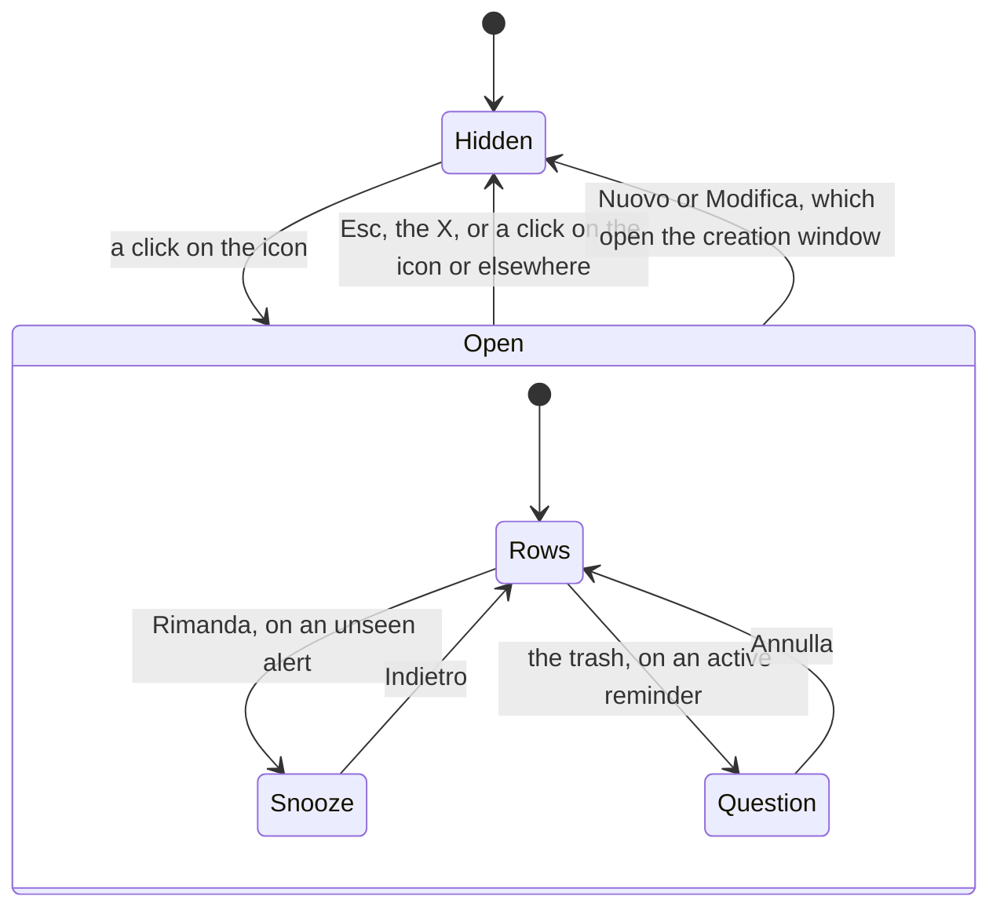

# The tray icon and its list

How Jiffin lives in the tray, in `jiffin.ui`. `ui/tray.py` draws the icon,
`ui/tray_list.py` holds the list's state and `ui/rows.py` its rows;
`qml/TrayIcon.qml` and `qml/TrayListWindow.qml` show them with our own
`FluentButton`, `FluentInfoBar` and `FluentScrollBar`. The behaviour comes
from decision ticket [#12](https://github.com/devfrx/jiffin/issues/12) and
[#43](https://github.com/devfrx/jiffin/issues/43), the look from
[ADR-0010](../adr/0010-windows-11-look-own-components.md); the
[mockup](mockups/tray.html) shows the list in light and dark.

## The icon

- Segoe Fluent Icons' document glyph, as on the alerts, drawn in Python at the
  size Windows shows a small icon, 16 px at 100% and 20 px at 125%: dark on a
  light taskbar, white on a dark one. The taskbar follows Windows' mode, which
  can differ from the apps' mode.
- A dot at the top right, in the accent's shade for the taskbar, while an alert
  waits for a place on screen or one vanished and the list has not shown it yet
  ([lifecycles](lifecycles.md)). A "!" at the bottom right, in WinUI's caution
  colours, while a browser's address cannot be read
  ([ADR-0005](../adr/0005-browser-address-ui-automation.md)). Each badge is cut
  out of the glyph with a clear ring and sits on whole pixels, sharp at 16 px.
- The picture reaches the tray through an image provider whose address names
  all it needs: a change of look or state loads a new picture.
- A click opens or closes the list. The right-click menu is Windows' own, with
  Impostazioni, which opens the [settings](settings.md), and Esci; it is dark
  when the apps' mode is (ADR-0010).
- Windows 11 puts a new icon in the ^ overflow, until the user brings it out.

## The list

- A card on the alerts' material, 368 px wide, 12 px from the bottom right
  corner of the work area, as Windows' flyouts, and like them without a
  taskbar button. It is as tall as what it shows, up to the work area, and
  then it scrolls; when it grows or shrinks, it keeps its bottom.
- It drags from any point no control takes ([ADR-0023](../adr/0023-window-frame.md)). While it shows
  it stays where it was left, and keeps its top left corner as it grows; it
  always opens again over the tray. The mouse does not scroll it by dragging,
  as in Windows' own lists: the wheel and the bar do.
- It takes the focus. Tab moves from button to button and scrolls the list to
  the one it reaches. Esc, the X, or a click anywhere else, closes it; so does
  a click on the icon, which first takes the focus away from the list: a click
  within 500 ms of that close (`REOPEN_MS`) does not open it again.
- From the top:
  - **Promemoria**, **Nuovo**, which opens the creation window
    ([creation](creation.md)), and the X, 12 px from the edge; Tab passes the X
    by, since Esc does the same;
  - what keeps Jiffin from working fully, each as a quiet line where only the
    icon has colour: the model file on its way, with its bar, Riprova on a
    problem and Dettagli ([first run](first-run.md)); the engine (below); and
    the browsers whose address cannot be read. The owner chose the line on
    screen, over WinUI's yellow box and a neutral card;
  - **Non visti**: the alerts that vanished unanswered, newest first, each with
    its condition, when it appeared, Fatto and Rimanda; Rimanda opens 15 min,
    1 ora and Domani inside the card;
  - **Attivi**: the active reminders, newest first, or "Nessun promemoria
    attivo.". A circle at the left completes, as in Microsoft To Do; the pencil
    opens the creation window on the reminder; the trash asks first,
    "Eliminare il promemoria per sempre?", with Annulla before Elimina. Under
    the action, its condition and, when useful, its snooze ("torna tra 12 min")
    and the places "Non qui" silenced it in. The owner chose the rows on screen.
- Answers go to `core`, and the list changes when `core`'s next view comes. A
  row that stays keeps its place, its focus and an open panel or question while
  others come and go; opening the list closes those left open.
- While it is open, the list reads the clock again every 10 s, for the
  snoozes' minutes.

## Seen

The open list sees the unseen alerts it shows. It tells `core` when it shows
one for the first time, and those keep a dot in their card until the list
closes. Once no alert waits and every vanished one is seen, the tray's dot
goes.

## The engine

`show_engine` takes one of six states, which the app will map from the
engine's supervisor ([#44](https://github.com/devfrx/jiffin/issues/44)):

| State | The list says | Riprova |
|---|---|---|
| `WORKING` | nothing: ready, starting, or not started yet | |
| `RESTARTING` | a warning: the model stopped and is starting again | no: it needs no hand |
| `FAILURES` | it stopped four times within an hour | yes |
| `MODEL` | the model cannot be loaded | yes |
| `GPU_MEMORY` | the GPU is out of memory: close an app that uses it | yes |
| `MISMATCH` | the engine is from another Jiffin version: reinstall | no: it cannot mend that |

## Trying it

`uv run python -m jiffin.ui --unreadable chrome.exe --engine failures` puts
the icon in the tray with its "!", and its list with both lines; Riprova
brings the engine back, and every answer is printed. The unit tests draw the
icon and drive the list on Qt's offscreen platform, which has no tray
(`tests/unit/ui/test_tray.py`, `test_tray_list.py` and `test_rows.py`). No
integration test clicks the icon, since Windows 11 puts a new one in the
overflow.
