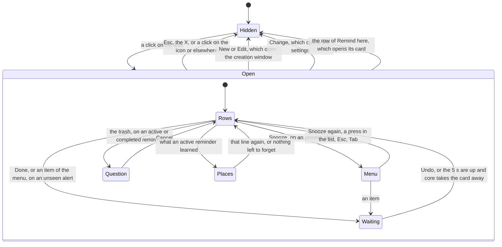

# The tray icon and its list

How Jiffin lives in the tray, in `jiffin.ui`. `ui/tray.py` draws the icon,
`ui/tray_list.py` holds the list's state and `ui/rows.py` its rows;
`qml/TrayIcon.qml` and `qml/TrayListWindow.qml` show them with our own
`FluentButton`, `FluentInfoBar` and `FluentScrollBar`, and the alert's
`AlertMenu`. The behaviour comes from decision tickets
[#12](https://github.com/devfrx/jiffin/issues/12),
[#43](https://github.com/devfrx/jiffin/issues/43) and
[#84](https://github.com/devfrx/jiffin/issues/84), the pause from
[ADR-0024](../adr/0024-hold-and-hide-alerts.md), Remind here and what the
reminders learned from [ADR-0029](../adr/0029-learn-from-answers-per-place.md),
Undo and the completed reminders from
[ADR-0030](../adr/0030-undo-and-reopen.md), the situations from
[ADR-0028](../adr/0028-read-the-situations-in-core.md) and
[#153](https://github.com/devfrx/jiffin/issues/153), the look from
[ADR-0010](../adr/0010-windows-11-look-own-components.md); the
[mockup](mockups/tray.html) shows the list in light and dark.

## The icon

- Segoe Fluent Icons' document glyph, as on the alerts, drawn in Python at the
  size Windows shows a small icon, 16 px at 100% and 20 px at 125%: dark on a
  light taskbar, white on a dark one. The taskbar follows Windows' mode, which
  can differ from the apps' mode.
- A dot at the top right, in the accent's shade for the taskbar, while an alert
  waits for a place on screen or one vanished and the list has not shown it yet
  ([lifecycles](lifecycles.md)). A "!" at the bottom right, in WinUI's caution
  colours, while a browser's address cannot be read
  ([ADR-0005](../adr/0005-browser-address-ui-automation.md)). While Jiffin is
  paused, the same corner shows two bars on a disc in the glyph's ink, as
  OneDrive shows its pause, instead of the "!": nothing is judged meanwhile,
  and the list still names the browser. The owner chose it on the real
  taskbar among four variants (#105): the pause badge, the glyph dimmed with
  or without it, and "Zz" as Windows' Do Not Disturb. Each badge is cut out of
  the glyph with a clear ring and sits on whole pixels, sharp at 16 px.
- The picture reaches the tray through an image provider whose address names
  all it needs: a change of look or state loads a new picture. The tooltip is
  "Jiffin", with "In pausa" under it while paused.
- A click opens or closes the list. The right-click menu is Windows' own:
  "Sospendi per un'ora" and "Sospendi fino a domani", or "Riprendi" while
  paused ([lifecycles](lifecycles.md)); a separator; Settings, which opens
  the [settings](settings.md), and Quit. It is dark when the apps' mode is
  (ADR-0010).
- Windows 11 puts a new icon in the ^ overflow, until the user brings it out.

## The list

- A card on the alerts' material, 368 px wide, 12 px from the bottom right
  corner of the work area, as Windows' flyouts, and like them without a
  taskbar button. It is as tall as what it shows, up to the work area, and
  then it scrolls; when it grows or shrinks, it keeps its bottom.
- It drags from any point no control takes
  ([ADR-0023](../adr/0023-window-frame.md)). While it shows it stays where it
  was left, and keeps its top left corner as it grows; it always opens again
  over the tray. The mouse does not scroll it by dragging, as in Windows' own
  lists: the wheel and the bar do.
- It takes the focus. Tab moves from button to button and scrolls the list to
  the one it reaches. Esc, the X, or a click anywhere else, closes it; so does
  a click on the icon, which first takes the focus away from the list: a click
  within 500 ms of that close (`REOPEN_MS`) does not open it again.
- From the top:
  - the title, "Promemoria", **New**, which opens the creation window
    ([creation](creation.md)), and the X, 12 px from the edge; Tab passes the X
    by, since Esc does the same;
  - the row of **Remind here** on a card's fill: the bell (Ringer), "Qui
    dovevi avvisarmi", the place under it and a chevron. It opens the card that
    Win+Shift+Q opens ([overlay](overlay.md)), and the list closes; it stays
    when another app holds the keys. The place is the last one Jiffin judged,
    asked of `core` each time the list opens: the list is one of Jiffin's
    windows, so it is the window before;
  - while Jiffin is paused, "In pausa fino alle 15:30." ("fino a domani alle
    08:00." when it ends on a later day), with **Resume**, as the icon's menu
    has it; the same quiet line as those below, with the news icon;
  - what keeps Jiffin from working fully, each as a quiet line where only the
    icon has colour: the model file on its way, with its bar, Retry on a
    problem and Details ([first run](first-run.md)); the engine (below); and
    the browsers whose address cannot be read. The owner chose the line on
    screen, over WinUI's yellow box and a neutral card;
  - while an active reminder names home or the office and no network has
    that label, a warning line with a button
    ([below](#a-place-no-network-has));
  - **Unseen**: the alerts that vanished unanswered, newest first, one per
    reminder ([ADR-0021](../adr/0021-one-alert-per-unit.md)), each with its
    condition without the time, its situations after it, and when it appeared
    ("Quando apro Outlook · alla fine della call, ieri alle 23:12"; with only
    a time, only when: "Ieri alle 15:00"), Done and
    Snooze, which opens the alert's menu (below). Their answer waits 5 s on
    the card with **Undo**, as on the alert: the answer's name and Undo take the
    place of the buttons, and a bar of 5 s runs on the card's lower edge, clear
    of its rounded corners; the keyboard's focus goes from Done or Snooze to
    Undo, and back to Done. Then the answer goes, and the card keeps its name
    until `core` takes it away. The list closing sends a waiting answer at
    once, since a hidden list shows no Undo; an alert that leaves the list
    meanwhile (its reminder completed or deleted, or ringing again) takes its
    answer away;
  - **Active**: the active reminders, newest first, or "Nessun promemoria
    attivo.". A circle at the left completes at once, as in Microsoft To Do:
    the completed reminders are its way back; a
    reminder of every time ("Ogni volta") has the arrows of its alert there
    instead, RepeatAll, an icon and not a button, since it never completes. The
    pencil opens the creation window on the reminder; the trash asks first,
    "Eliminare il promemoria per sempre?", with Cancel before Delete. Under
    the action, its condition without the time and the situations; then each
    situation on its line, beside its icon at the caption's size, as under
    "Quando" ([creation](creation.md#the-situations)): "Alla fine della call";
    then the time understood, by
    a clock, written for today's Jiffin day ("Ogni giorno dalle 23:00 alle
    04:00", "Oggi, giovedì 1 ottobre, alle 15:00",
    [ADR-0020](../adr/0020-read-the-time-in-core.md)): a reminder with only a
    time or situations has only those lines, one whose time was not understood
    only its condition, whole. Then, when useful: "Periodo finito il 30 settembre", once
    its period is over (`units.ended`), and its snooze ("torna tra 12 min").
    The owner chose the rows on screen. Last, what it learned, never as a
    number ([ADR-0029](../adr/0029-learn-from-answers-per-place.md)): "Taciuto
    in 2 posti · Chiesto in 1 posto · Più attento", the places Not here
    silenced it in, those Remind here asked it in, and whether its threshold
    went down. The line is a button with a chevron, and opens the places in the
    row, the last answered first: each with its bell, struck where Not here
    silenced it, its title (with the site in a browser) and an X, **Forget**, which forgets what
    the reminder learned there; then **Forget all**. A forgotten place is as if
    never answered, and `core` computes the threshold again;
  - **Completed** ([ADR-0030](../adr/0030-undo-and-reopen.md)), only when
    there are some: a row "Completati · 3" with a chevron, closed each time the
    list opens; open, the completed reminders, the most recently completed
    first. Each has the full circle in the accent colour (CompletedSolid),
    **Reopen**; the action struck through and grey, the owner's choice; under
    it the condition without its time, its situations after it, and when it
    was completed, on the
    calendar ("Quando apro la posta · completato alle 09:40", "… · completato
    ieri", "… · completato il 26 settembre"; with only a time, only when); and
    the trash, which asks first, as among the active. They stay until deleted
    ([ADR-0014](../adr/0014-feedback-data-retention.md));
  - after a thin line, the return pause: "Gli avvisi tornano se riprendi una
    cosa dopo almeno 2 min.", in minutes when it is whole minutes, as the
    settings show it, else in seconds ("90 s"), and **Change**, a subtle button
    that opens the settings, where it is set. The owner chose it on screen, over
    showing the pause only in the creation window.
- Answers go to `core`, and the list changes when `core`'s next view comes. A
  row that stays keeps its place, its focus and an open question or its open
  places while others come and go; opening the list closes those left open.
- While it is open, the list reads the clock again every 10 s, for the
  snoozes' minutes, for the time's "Oggi" and for the pause's "domani".

## Snooze's menu

- An unseen alert's Snooze opens the alert's own menu
  ([overlay](overlay.md)), with the same items in the same order: Next time,
  Quarter hour, Hour, Tomorrow, a line, Not here. Next time shows only when
  the reminder has a next unit, asked of `core` (`next_occasion`) when the
  menu opens.
- A window of its own on the glass, which never takes the focus: under the
  button, on its left edge and 4 px down, or over it, 4 px up, when it would
  go past the bottom of the work area, as Windows' menus do. The list sits
  over the tray, so the menu often opens upwards.
- An item answers for that alert, and the menu closes. A press anywhere in the
  list closes it and does nothing else, as WinUI's light dismiss: a second
  click on Snooze, or a press on another button, only closes it, and a drag
  does not start. So do the wheel, Esc, which closes the menu before the list,
  Tab, the alert leaving the list, and the list closing.
- The list keeps the focus, on Snooze, and its keys go to the menu before the
  button: Up and Down move over the items, round from the last to the first,
  with WinUI's focus ring; Space or Enter pick one. Opened by the keyboard, the
  menu starts on its first item; opened under the mouse, on none, and Space or
  Enter there are a click on Snooze, which closes it.

## Seen

The open list sees the unseen alerts it shows. It tells `core` when it shows
one for the first time, and those keep a dot in their card until the list
closes. Once no alert waits and every vanished one is seen, the tray's dot
goes.

## A place no network has

While an active reminder names home or the office ("a casa", "quando esco
dall'ufficio") and no network has that label, a warning line under the
browsers' says why it will not ring: "Non so ancora qual è la rete di casa: i
promemoria «a casa» non suonano." While the network in use has no label of
its own, the line has a button, "Sono a casa adesso" or "Sono in ufficio
adesso", which puts that label on it ([settings](settings.md#the-network)):
once it is on, the line goes. It names the first such place among the active
reminders. The owner chose it on #153's trial, with the creation window's info
bar and the settings' section: a reminder that can never ring would otherwise
fail in silence.

## The engine

`show_engine` takes one of six states, which the app will map from the
engine's supervisor ([#44](https://github.com/devfrx/jiffin/issues/44)):

| State | The list says | Retry |
|---|---|---|
| `WORKING` | nothing: ready, asleep, starting, or not started yet | |
| `RESTARTING` | a warning: the model stopped and is starting again | no: it needs no hand |
| `FAILURES` | it stopped four times within an hour | yes |
| `MODEL` | the model cannot be loaded | yes |
| `GPU_MEMORY` | the GPU is out of memory: close an app that uses it; also while the engine sleeps after a wake refused for it ([ADR-0027](../adr/0027-light-sleep-of-the-engine.md)) | yes |
| `MISMATCH` | the engine is from another Jiffin version: reinstall | no: it cannot mend that |

## Trying it

`uv run python -m jiffin.ui --unreadable chrome.exe --engine failures` puts
the icon in the tray with its "!", and its list with both lines, reminders
with a time, a perennial one and a period over, one silenced in two places,
reminders on situations, one of them at home, so the line of a place no
network has shows, and three completed ones; an alert left to vanish comes into the list after
10 s, with its menu, and Done on a one-off alert puts its reminder among the
completed. Retry brings the engine back, Pause in the icon's menu shows the
pause on the icon and in the list until Resume, a pick on the card of Remind
here adds its place to the reminder, and every answer is printed. The unit tests draw the icon and drive the list on
Qt's offscreen platform, which has no tray (`tests/unit/ui/test_tray.py`,
`test_tray_list.py` and `test_rows.py`); there every window takes the focus as
it shows, so the tests give it back to the list as Windows never takes it
(`focus_stays`). No integration test clicks the icon, since Windows 11 puts a
new one in the overflow.
